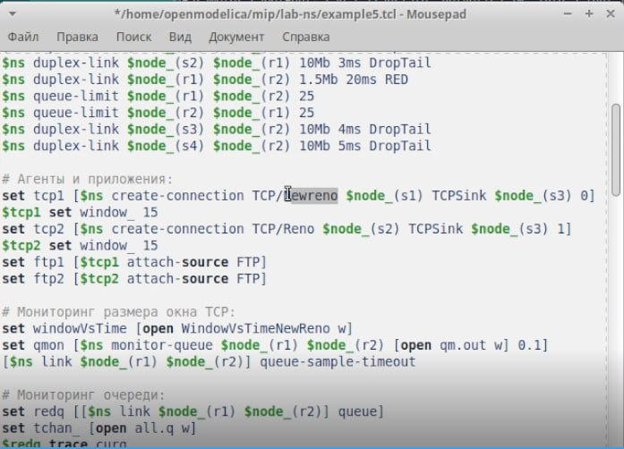
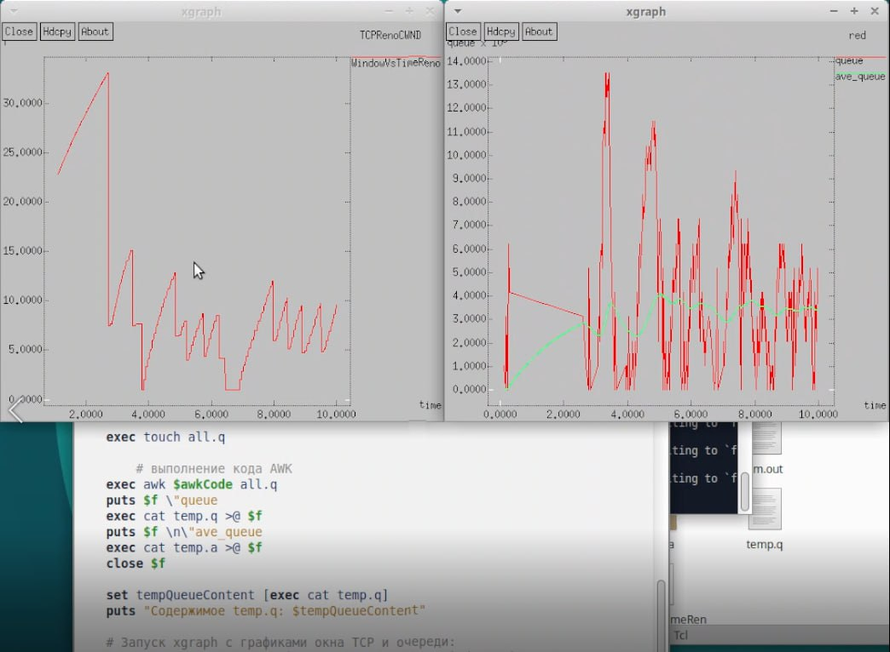
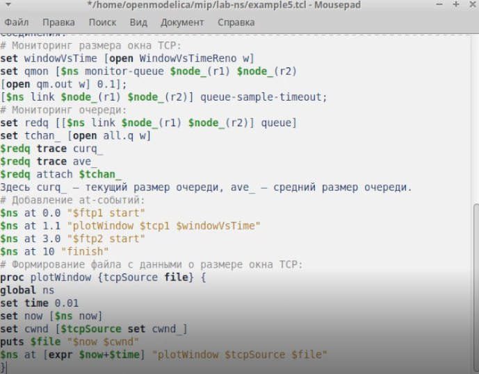
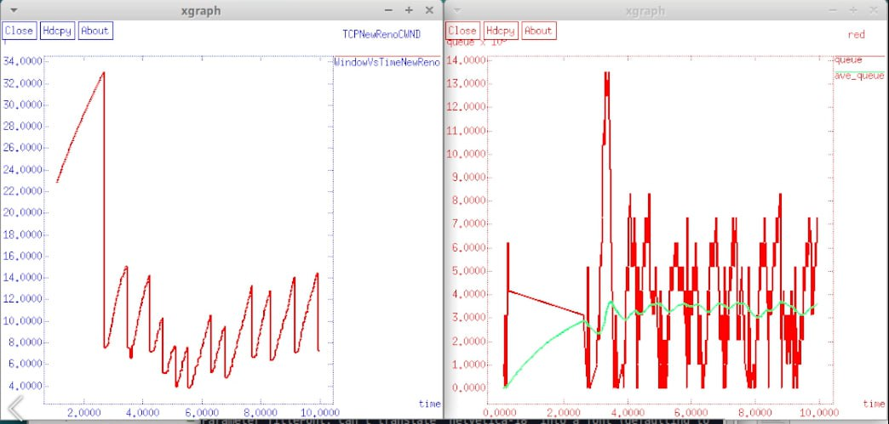
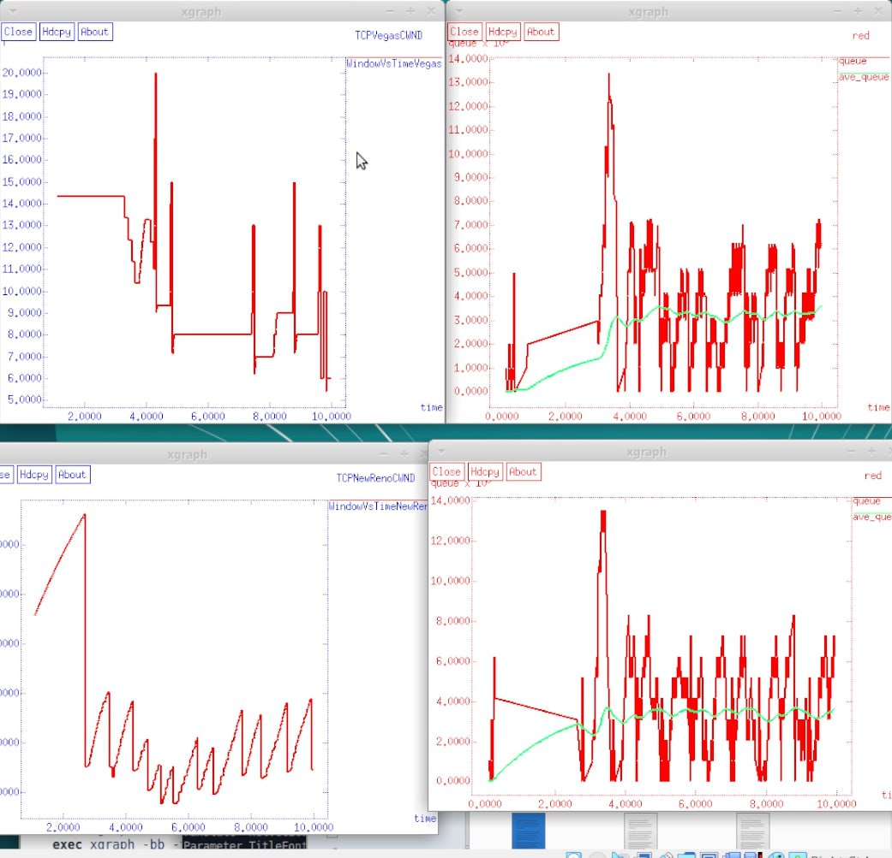

---
## Front matter
lang: ru-RU
title: Лабораторная работа 2
subtitle: Имитационное моделирование
author:
  - Голощапов Ярослав Вячеславович
institute:
  - Российский университет дружбы народов, Москва, Россия
date: 18 февраля 2025

## i18n babel
babel-lang: russian
babel-otherlangs: english

## Formatting pdf
toc: false
toc-title: Содержание
slide_level: 2
aspectratio: 169
section-titles: true
theme: metropolis
header-includes:
 - \metroset{progressbar=frametitle,sectionpage=progressbar,numbering=fraction}
---

# Информация

## Докладчик

:::::::::::::: {.columns align=center}
::: {.column width="70%"}

  * Голощапов Ярослав Вячеславович
  * студент 3 курса
  * Российский университет дружбы народов
  * [1132222003@pfur.ru](mailto:1132222003@pfur.ru)
  * <https://yvgoloschapov.github.io/ru/>

:::
::: {.column width="30%"}

:::
::::::::::::::

## Цель работы

Исследование протокола TCP и алгоритма управления очередью RED

## Задание

Получить практические навыки на примерах и выполнить упражнение

## Теоретическое введение

Протокол управления передачей (Transmission Control Protocol, TCP) имеет сред-
ства управления потоком и коррекции ошибок, ориентирован на установление
соединения.

# Выполнение лабораторной работы

## Постановка задачи Описание моделируемой сети:
– сеть состоит из 6 узлов;
– между всеми узлами установлено дуплексное соединение с различными пропуск-
ной способностью и задержкой 10 мс (см. рис. 2.4);
– узел r1 использует очередь с дисциплиной RED для накопления пакетов, макси-
мальный размер которой составляет 25;
– TCP-источники на узлах s1 и s2 подключаются к TCP-приёмнику на узле s3;
– генераторы трафика FTP прикреплены к TCP-агентам.
На рис. 2.4 приведена схема моделируемой сети. 
Требуется разработать сценарий, реализующий модель согласно рис. 2.4, по-
строить в Xgraph график изменения TCP-окна, график изменения длины очереди
и средней длины очереди. 

##

{#fig:001 width=70%}

##

{#fig:004 width=70%}

## Упражнение
– Измените в модели на узле s1 тип протокола TCP с Reno на NewReno, затем на
Vegas. Сравните и поясните результаты.
– Внесите изменения при отображении окон с графиками (измените цвет фона,
цвет траекторий, подписи к осям, подпись траектории в легенде)

##

{#fig:002 width=70%}

##

{#fig:003 width=70%}

## Модель Vegas 

{#fig:005 width=70%}

## Выводы

В этой лабораторной работе я исследовал протокол TCP и алгоритм управления очередью RED

