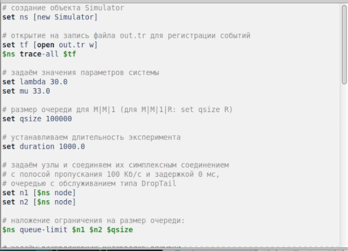
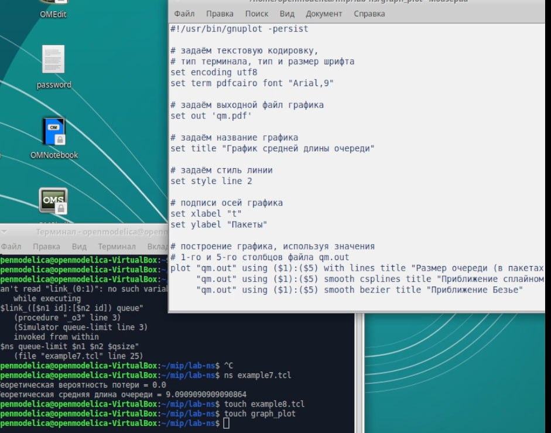
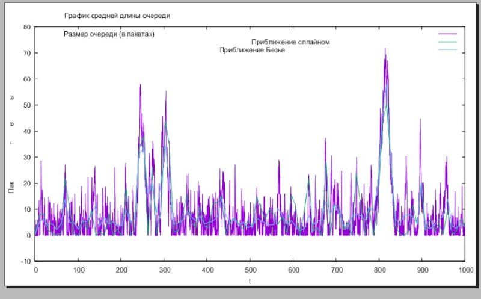

---
## Front matter
lang: ru-RU
title: Лабораторная работа 3
subtitle: Имитационное моделирование
author:
  - Голощапов Ярослав Вячеславович
institute:
  - Российский университет дружбы народов, Москва, Россия
date: 18 февраля 2025

## i18n babel
babel-lang: russian
babel-otherlangs: english

## Formatting pdf
toc: false
toc-title: Содержание
slide_level: 2
aspectratio: 169
section-titles: true
theme: metropolis
header-includes:
 - \metroset{progressbar=frametitle,sectionpage=progressbar,numbering=fraction}
---

# Информация

## Докладчик

:::::::::::::: {.columns align=center}
::: {.column width="70%"}

  * Голощапов Ярослав Вячеславович
  * студент 3 курса
  * Российский университет дружбы народов
  * [1132222003@pfur.ru](mailto:1132222003@pfur.ru)
  * <https://yvgoloschapov.github.io/ru/>

:::
::: {.column width="30%"}

:::
::::::::::::::

## Цель работы

Моделирование стохастических процессов

## Задание

Получить практические навыки на примерах и выполнить упражнение

## Теоретическое введение

M |M |1 — однолинейная СМО с накопителем бесконечной ёмкости. Поступаю-
щий поток заявок — пуассоновский с интенсивностью λ. Времена обслуживания
заявок — независимые в совокупности случайные величины, распределённые по
экспоненциальному закону с параметром μ.

# Выполнение лабораторной работы

## Реализация модели СМО 

{#fig:001 width=70%}

##

{#fig:002 width=70%}

## В каталоге с проектом создал отдельный файл graph_plot и добавил код соблюдая синтаксис

{#fig:003 width=70%}

## Упражнение:

Сделайте файл исполняемым. После компиляции файла с проектом, запустите
скрипт в созданном файле graph_plot, который создаст файл qm.pdf с результата-
ми моделирования

##

{#fig:004 width=70%}

##

{#fig:005 width=70%}

## Выводы

В этой лабораторной работе я научился моделировать стохастические процессы

