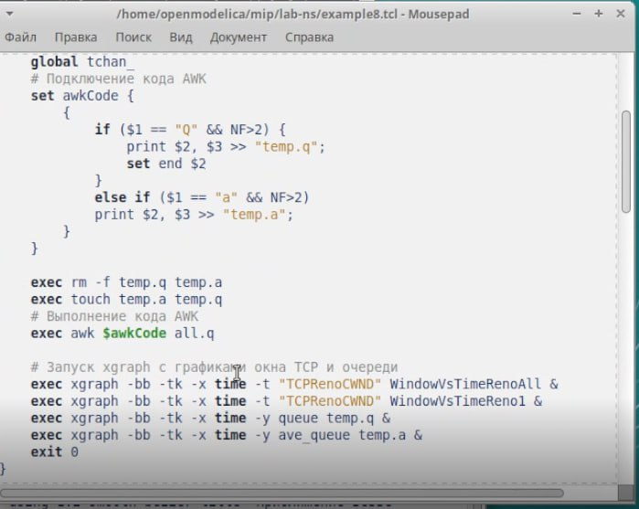
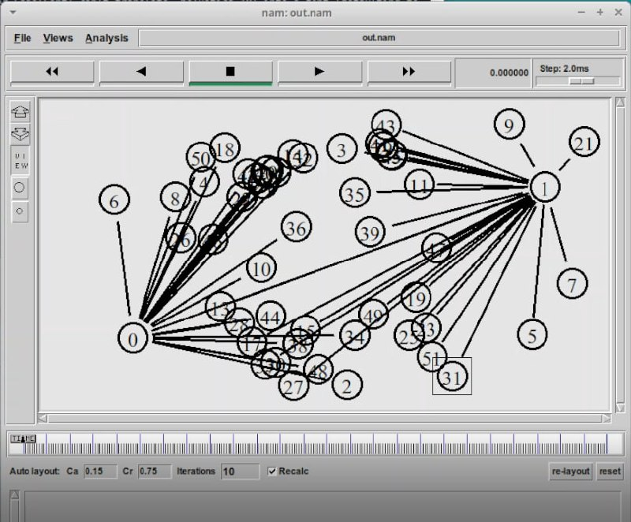
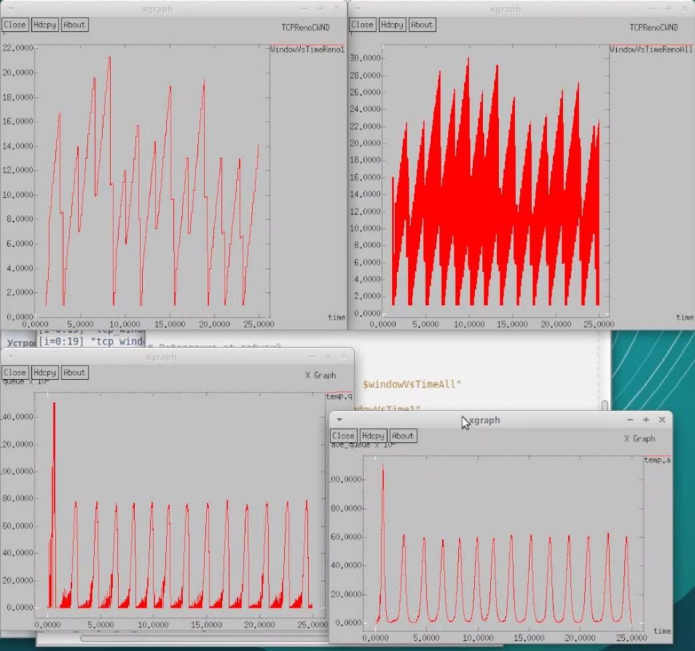
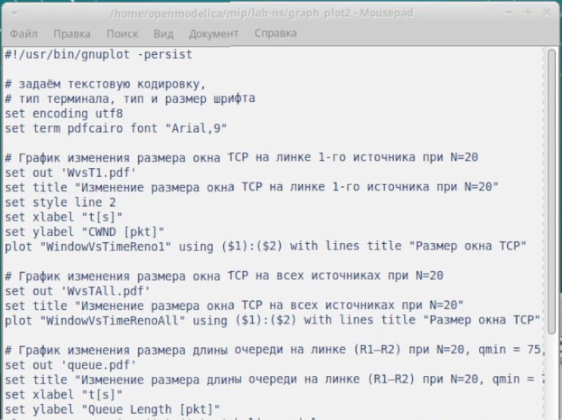
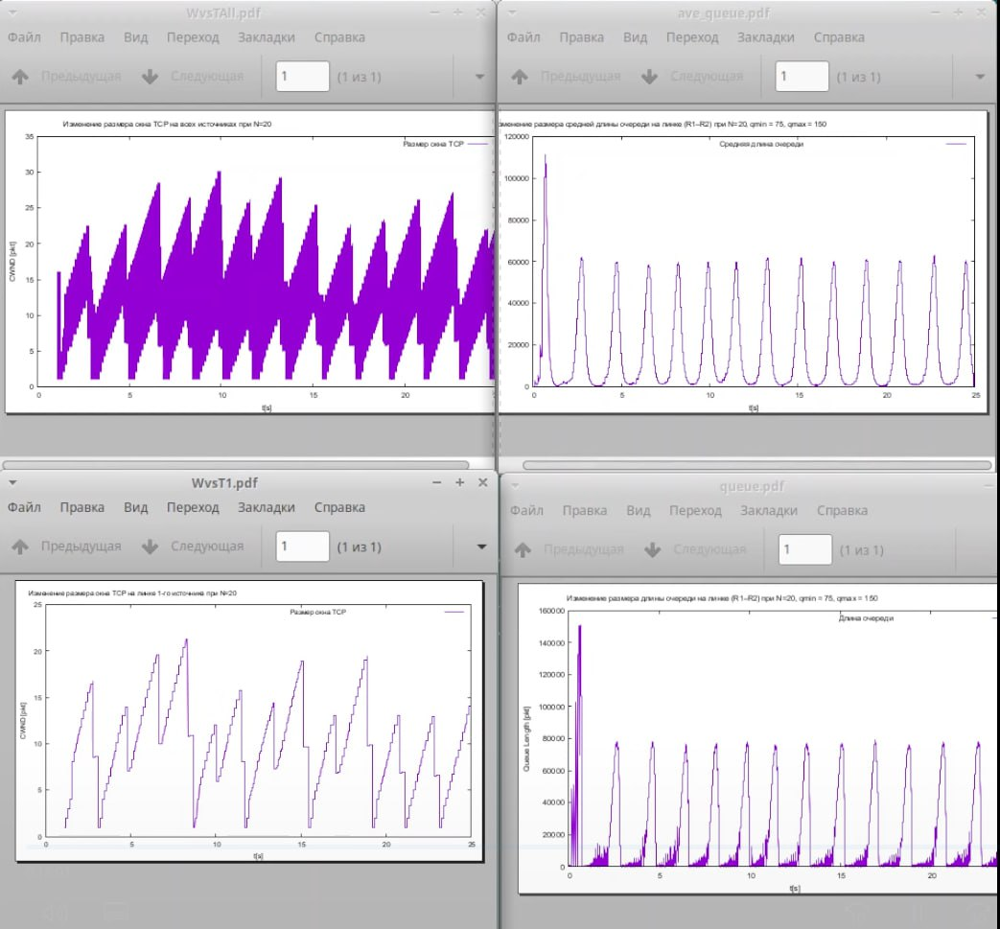

---
## Front matter
lang: ru-RU
title: Лабораторная работа 4
subtitle: Имитационное моделирование
author:
  - Голощапов Ярослав Вячеславович
institute:
  - Российский университет дружбы народов, Москва, Россия
date: 18 февраля 2025

## i18n babel
babel-lang: russian
babel-otherlangs: english

## Formatting pdf
toc: false
toc-title: Содержание
slide_level: 2
aspectratio: 169
section-titles: true
theme: metropolis
header-includes:
 - \metroset{progressbar=frametitle,sectionpage=progressbar,numbering=fraction}
---

# Информация

## Докладчик

:::::::::::::: {.columns align=center}
::: {.column width="70%"}

  * Голощапов Ярослав Вячеславович
  * студент 3 курса
  * Российский университет дружбы народов
  * [1132222003@pfur.ru](mailto:1132222003@pfur.ru)
  * <https://yvgoloschapov.github.io/ru/>

:::
::: {.column width="30%"}

:::
::::::::::::::

## Цель работы

Выполнить задание для самостоятельного выполнения

## Задание

1. Для приведённой схемы разработать имитационную модель в пакете NS-2.
2. Построить график изменения размера окна TCP (в Xgraph и в GNUPlot);
3. Построить график изменения длины очереди и средней длины очереди на первом
маршрутизаторе.
4. Оформить отчёт о выполненной работе

# Выполнение лабораторной работы

## Описание моделируемой сети:
– сеть состоит из N TCP-источников, N TCP-приёмников, двух маршрутизаторов
R1 и R2 между источниками и приёмниками (N — не менее 20);
– между TCP-источниками и первым маршрутизатором установлены дуплексные
соединения с пропускной способностью 100 Мбит/с и задержкой 20 мс очередью
типа DropTail;
– между TCP-приёмниками и вторым маршрутизатором установлены дуплексные
соединения с пропускной способностью 100 Мбит/с и задержкой 20 мс очередью
типа DropTail;
– между маршрутизаторами установлено симплексное соединение (R1–R2) с про-
пускной способностью 20 Мбит/с и задержкой 15 мс очередью типа RED,
размером буфера 300 пакетов; в обратную сторону — симплексное соедине-
ние (R2–R1) с пропускной способностью 15 Мбит/с и задержкой 20 мс очередью
типа DropTail;
– данные передаются по протоколу FTP поверх TCPReno;
– параметры алгоритма RED: qmin = 75, qmax = 150, qw = 0, 002, pmax = 0.1;
– максимальный размер TCP-окна 32; размер передаваемого пакета 500 байт; время
моделирования — не менее 20 единиц модельного времени.

## Разработка имитационной модели в пакете NS-2 

{#fig:001 width=70%}

##

{#fig:002 width=70%}

##

{#fig:003 width=70%}

## Разработка модели с помощью GNUplot 

{#fig:004 width=70%}

##

{#fig:005 width=70%}

## Выводы

В этой лабораторной работе я выполнил задание для самостоятельной работы и освоил практические знания

