---
## Front matter
lang: ru-RU
title: Лабораторная работа 5
subtitle: Имитационное моделирование
author:
  - Голощапов Ярослав Вячеславович
institute:
  - Российский университет дружбы народов, Москва, Россия
date: 27 февраля 2025

## i18n babel
babel-lang: russian
babel-otherlangs: english

## Formatting pdf
toc: false
toc-title: Содержание
slide_level: 2
aspectratio: 169
section-titles: true
theme: metropolis
header-includes:
 - \metroset{progressbar=frametitle,sectionpage=progressbar,numbering=fraction}
---

# Информация

## Докладчик

:::::::::::::: {.columns align=center}
::: {.column width="70%"}

  * Голощапов Ярослав Вячеславович
  * студент 3 курса
  * Российский университет дружбы народов
  * [1132222003@pfur.ru](mailto:1132222003@pfur.ru)
  * <https://yvgoloschapov.github.io/ru/>

:::
::: {.column width="30%"}

:::
::::::::::::::

## Цель работы

Построение модели эпидемии SIR

## Задание

Получить практические навыки на примерах и выполнить упражнение

## Теоретическое введение

Модель SIR предложена в 1927 г. (W. O. Kermack, A. G. McKendrick). С описанием
модели можно ознакомиться, например в [1].
Предполагается, что особи популяции размера N могут находиться в трёх различ-
ных состояниях:
– S (susceptible, уязвимые) — здоровые особи, которые находятся в группе риска
и могут подхватить инфекцию;
– I (infective, заражённые, распространяющие заболевание) — заразившиеся пере-
носчики болезни;
– R (recovered/removed, вылечившиеся) — те, кто выздоровел и перестал распро-
странять болезнь (в эту категорию относят, например, приобретших иммунитет
или умерших).

# Выполнение лабораторной работы

## Строим модель SIR в xcos .

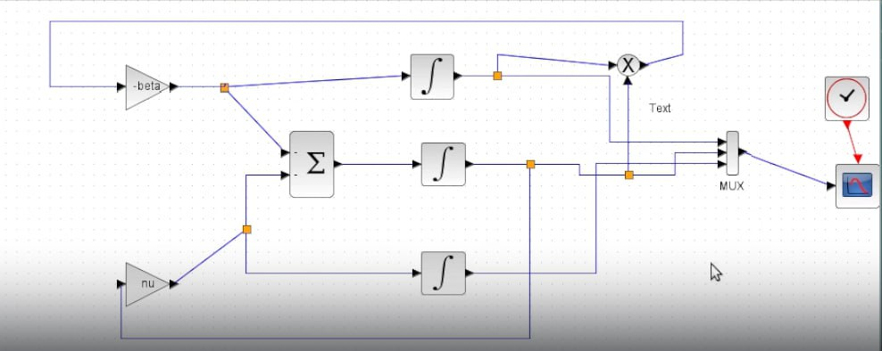{#fig:001 width=70%}

## Вывод графика .

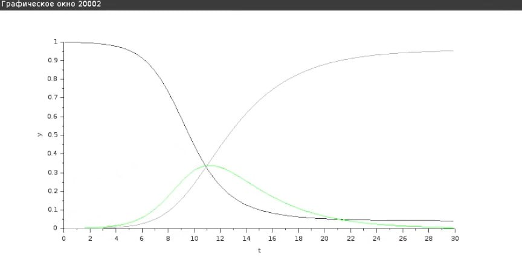{#fig:002 width=70%}

## Построение модели с помощью блока Modelica

{#fig:003 width=70%}

## Код в openmodelica  и вывод грфика 

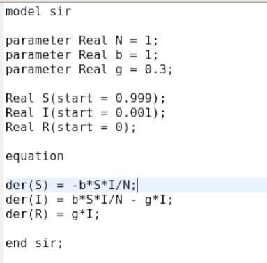{#fig:004 width=70%}

##

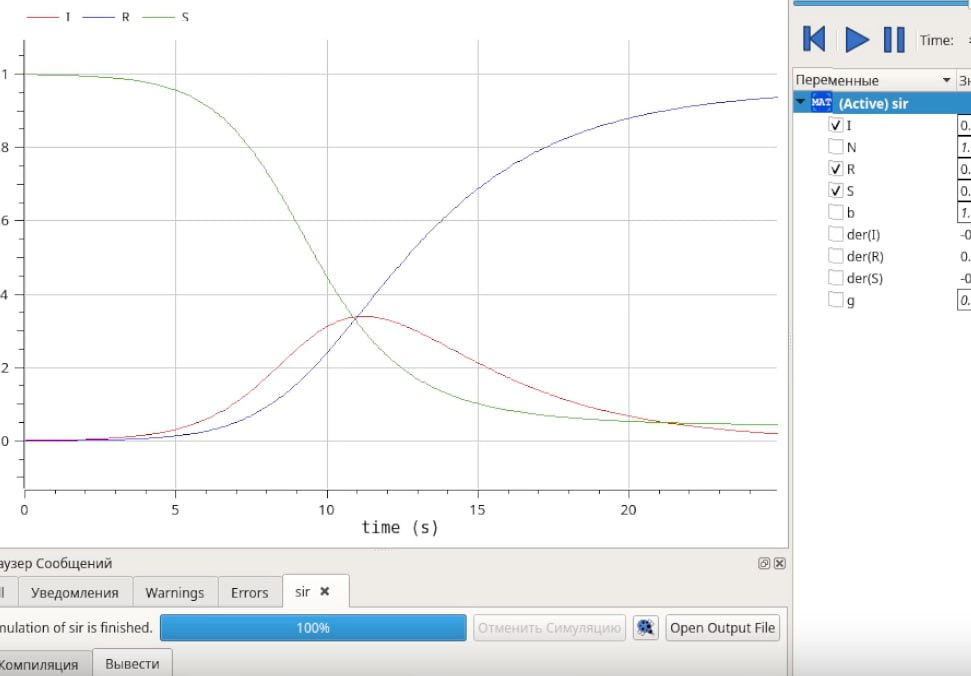{#fig:005 width=70%}

# Задание для самостоятельного выполнения

## Схема и график

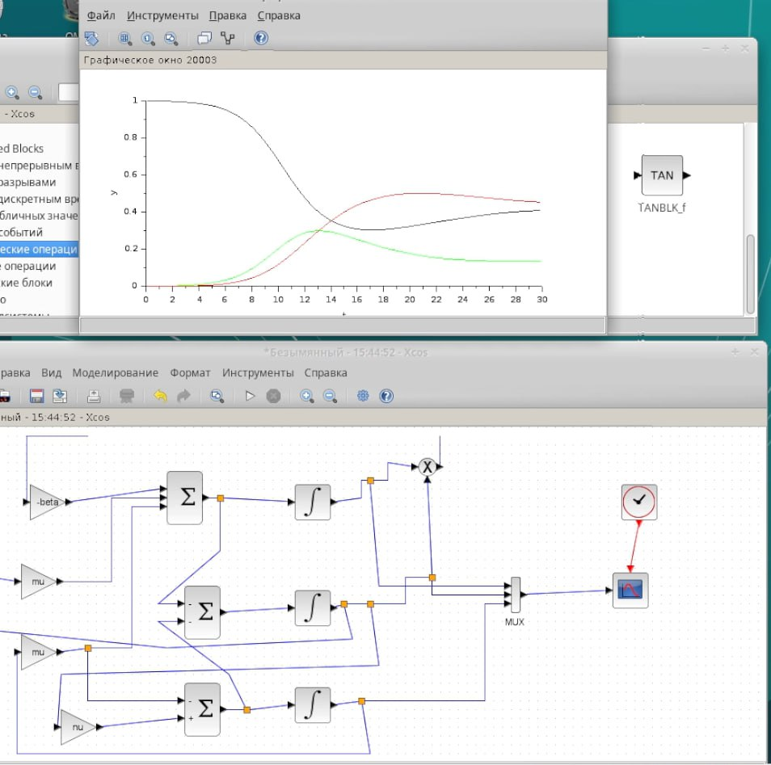{#fig:006 width=70%}

## Схема и график с блоком Modelica 

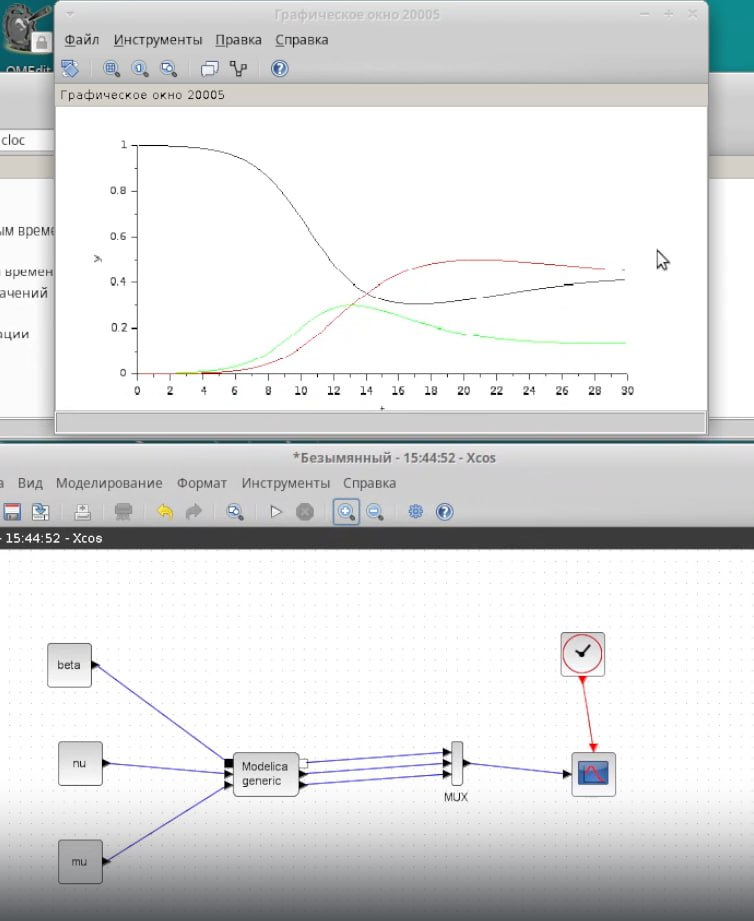{#fig:007 width=70%}

## Код в OpenModelica 

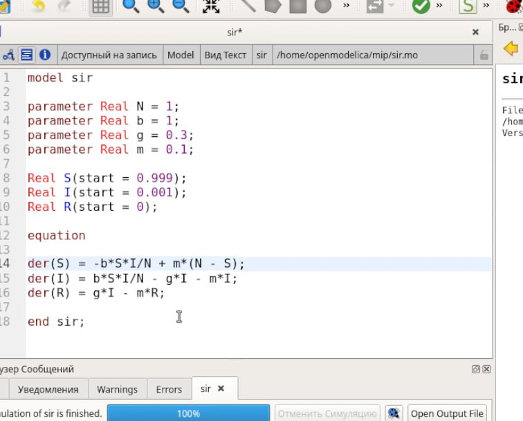{#fig:008 width=70%}

## Графики с различными значениями параметров

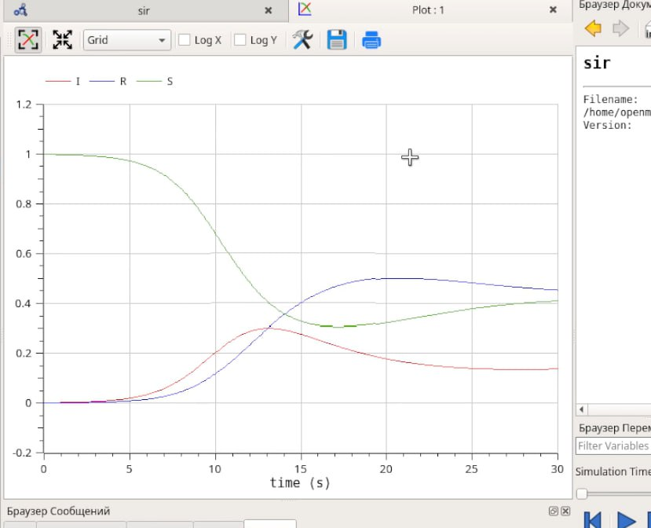{#fig:009 width=70%}

##

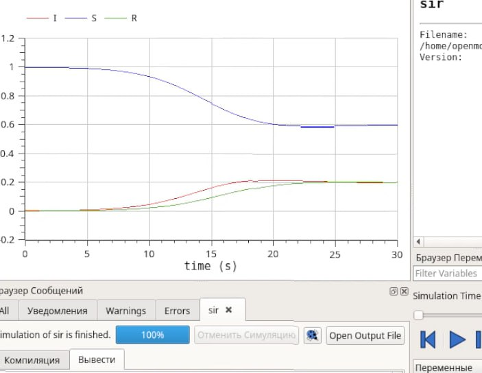{#fig:010 width=70%}

##

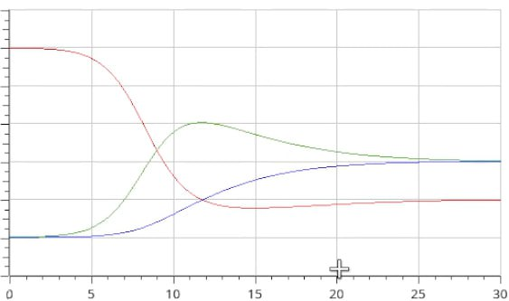{#fig:011 width=70%}

##

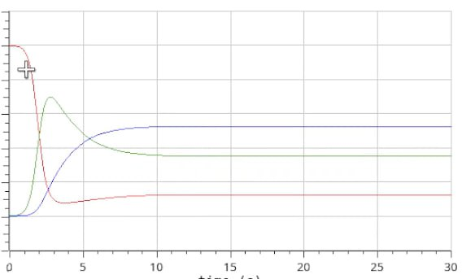{#fig:012 width=70%}

## Выводы

В этой лабораторной работе я приобрел навыки построения модели эпидемии SIR

