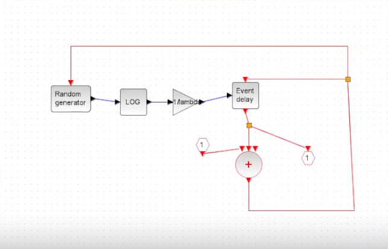
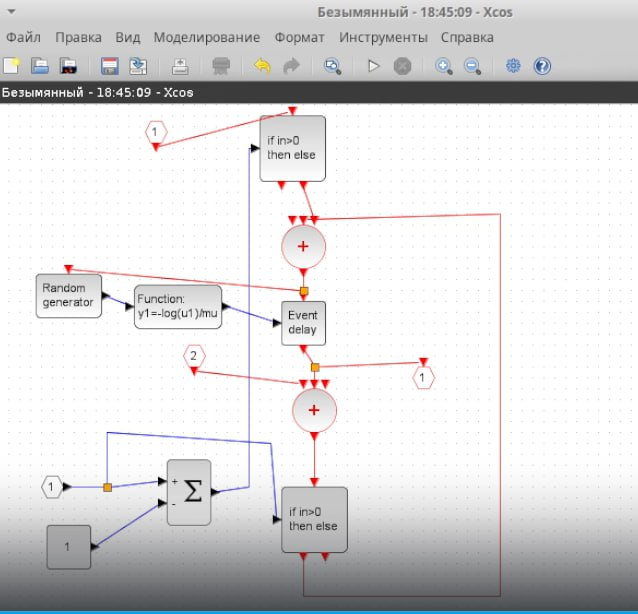
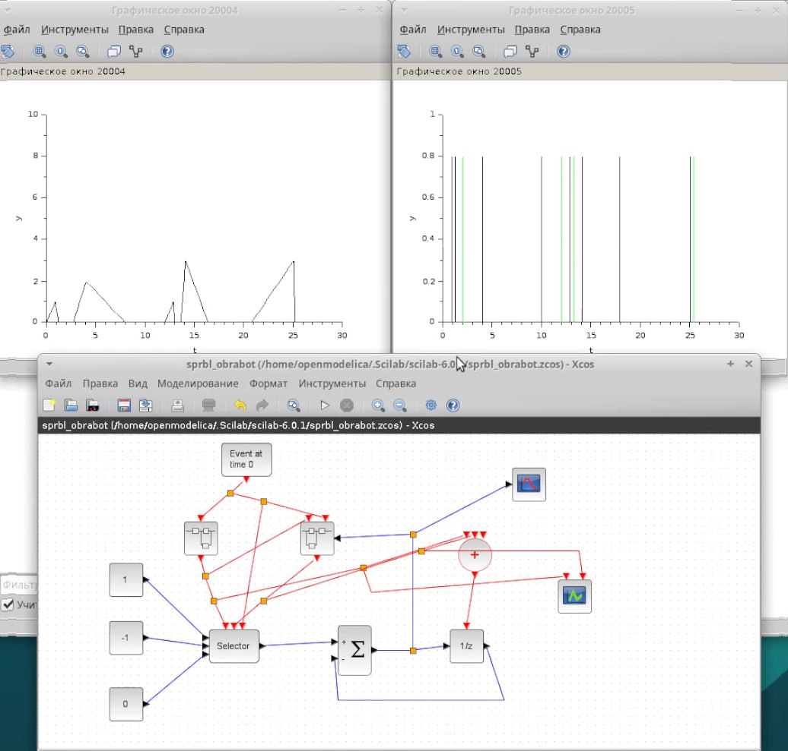

---
## Front matter
lang: ru-RU
title: Лабораторная работа 7
subtitle: Имитационное моделирование
author:
  - Голощапов Ярослав Вячеславович
institute:
  - Российский университет дружбы народов, Москва, Россия
date: 27 февраля 2025

## i18n babel
babel-lang: russian
babel-otherlangs: english

## Formatting pdf
toc: false
toc-title: Содержание
slide_level: 2
aspectratio: 169
section-titles: true
theme: metropolis
header-includes:
 - \metroset{progressbar=frametitle,sectionpage=progressbar,numbering=fraction}
---

# Информация

## Докладчик

:::::::::::::: {.columns align=center}
::: {.column width="70%"}

  * Голощапов Ярослав Вячеславович
  * студент 3 курса
  * Российский университет дружбы народов
  * [1132222003@pfur.ru](mailto:1132222003@pfur.ru)
  * <https://yvgoloschapov.github.io/ru/>

:::
::: {.column width="30%"}

:::
::::::::::::::

## Цель работы

Построить модель системы массового обслуживания

# Выполнение лабораторной работы

## Построиние схемы суперблока, моделирующего поступление заявок 

{#fig:001 width=70%}

## Построиние схемы суперблока, моделирующего обработку заявок 

{#fig:002 width=70%}

## Вся модель системы и графики 

{#fig:003 width=70%}

## Выводы

В этой лабораторной работе я научился строить модель системы массового обслуживания
