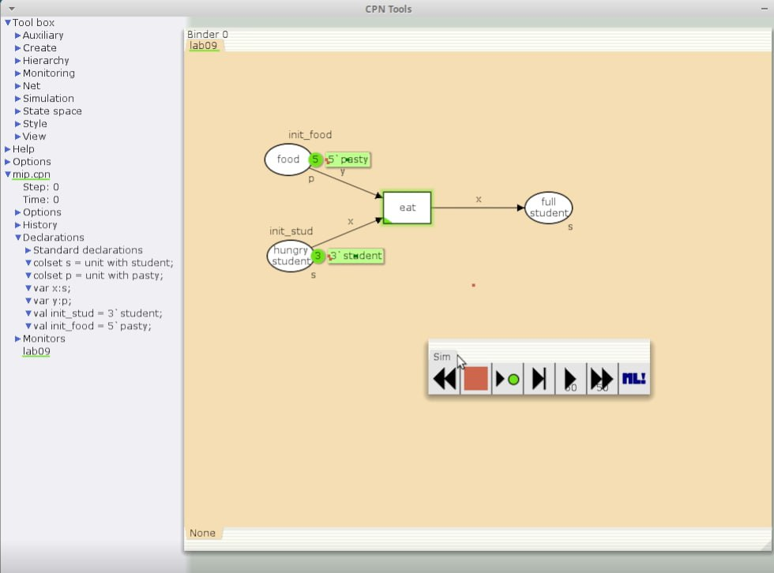
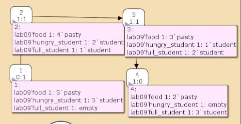
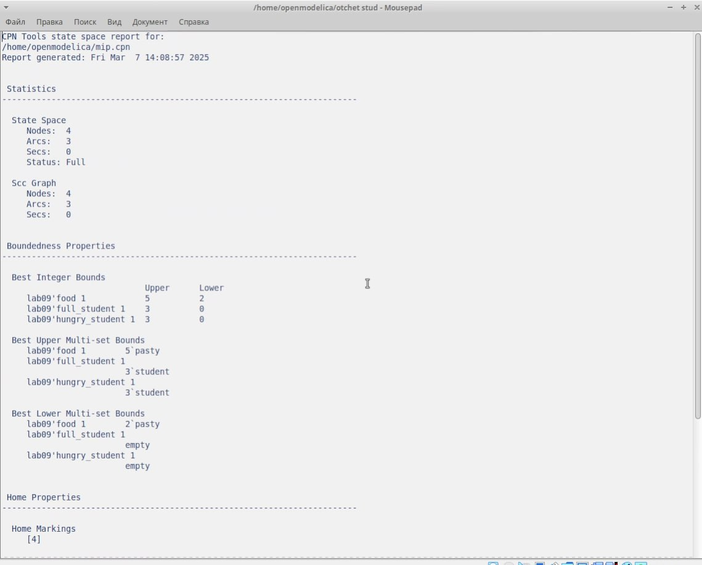

---
## Front matter
lang: ru-RU
title: Лабораторная работа 9
subtitle: Имитационное моделирование
author:
  - Голощапов Ярослав Вячеславович
institute:
  - Российский университет дружбы народов, Москва, Россия
date: 27 февраля 2025

## i18n babel
babel-lang: russian
babel-otherlangs: english

## Formatting pdf
toc: false
toc-title: Содержание
slide_level: 2
aspectratio: 169
section-titles: true
theme: metropolis
header-includes:
 - \metroset{progressbar=frametitle,sectionpage=progressbar,numbering=fraction}
---

# Информация

## Докладчик

:::::::::::::: {.columns align=center}
::: {.column width="70%"}

  * Голощапов Ярослав Вячеславович
  * студент 3 курса
  * Российский университет дружбы народов
  * [1132222003@pfur.ru](mailto:1132222003@pfur.ru)
  * <https://yvgoloschapov.github.io/ru/>

:::
::: {.column width="30%"}

:::
::::::::::::::

## Цель работы

Построить модель "Накорми студентов"

# Выполнение лабораторной работы

## Граф сети модели с новыми декларациями 

{#fig:001 width=70%}

## Граф пространства состояний 

{#fig:002 width=70%}

## Отчёт о пространстве состояний: 
В графе 4 узла и 3 дуги, соответственно 4 состояния и 3 перехода.
Затем указаны границы значений для каждого элемента: голодные студенты (максимум - 3, минимум - 0), сытые студенты (максимум - 3, минимум - 0), еда (максимум - 5, минимум - 2, минимальное значение 2, так как в конце симуляции остаются пирожки).
Также указаны границы мультимножеств.
Маркировка home равная 4, так как в эту позицию мы можем попасть из любой другой маркировки.
Маркировка dead равная 4, так как из неё переходов быть не может.
В конце указано, что нет бесконечных последовательностей вхождений.

##

{#fig:003 width=70%}

## Выводы

В этой лабораторной работе я научился строить модель Накорми студентов
