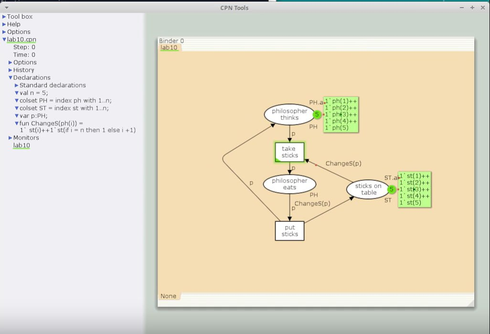
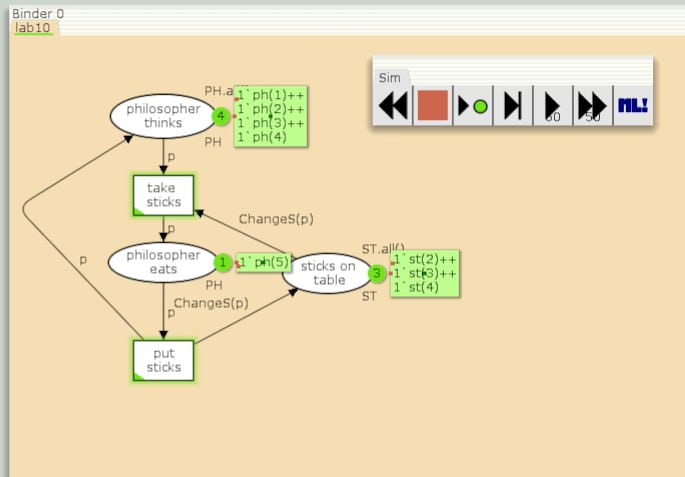
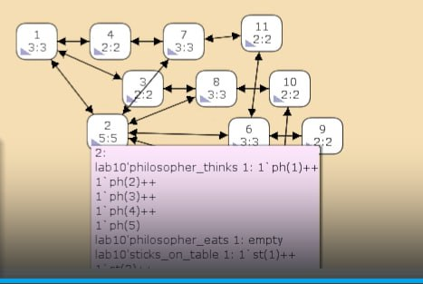
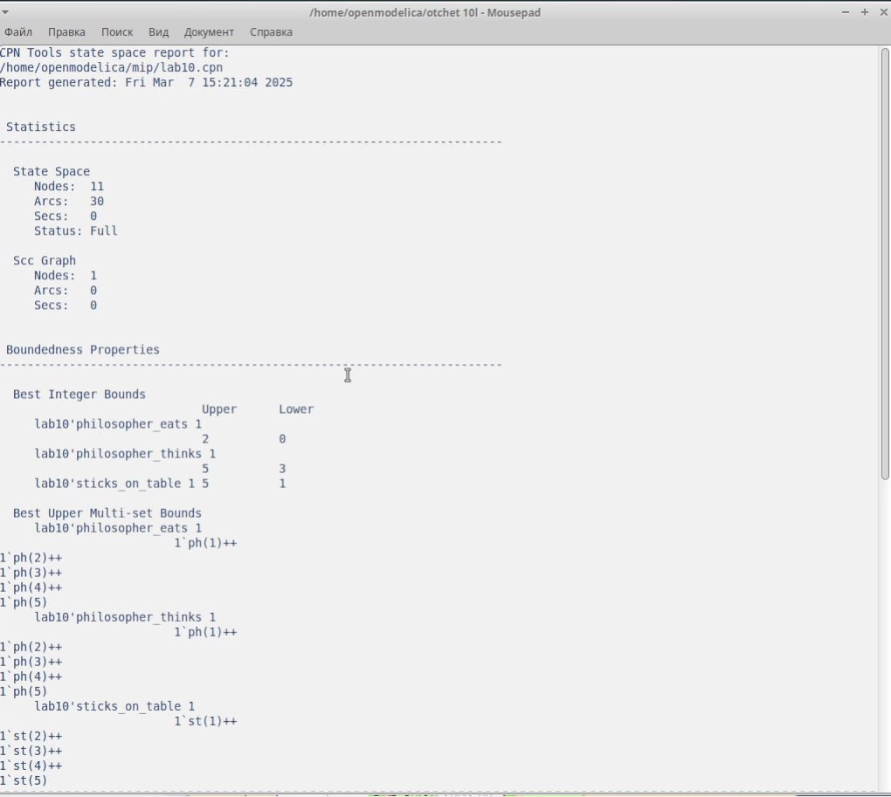

---
## Front matter
lang: ru-RU
title: Лабораторная работа 10
subtitle: Имитационное моделирование
author:
  - Голощапов Ярослав Вячеславович
institute:
  - Российский университет дружбы народов, Москва, Россия
date: 27 февраля 2025

## i18n babel
babel-lang: russian
babel-otherlangs: english

## Formatting pdf
toc: false
toc-title: Содержание
slide_level: 2
aspectratio: 169
section-titles: true
theme: metropolis
header-includes:
 - \metroset{progressbar=frametitle,sectionpage=progressbar,numbering=fraction}
---

# Информация

## Докладчик

:::::::::::::: {.columns align=center}
::: {.column width="70%"}

  * Голощапов Ярослав Вячеславович
  * студент 3 курса
  * Российский университет дружбы народов
  * [1132222003@pfur.ru](mailto:1132222003@pfur.ru)
  * <https://yvgoloschapov.github.io/ru/>

:::
::: {.column width="30%"}

:::
::::::::::::::

## Цель работы

Решить задачу об обедающих мудрецах

# Выполнение лабораторной работы

## Граф модели с новыми декларациями

{#fig:001 width=70%}

## Запуск симуляции. 
Исходя из этого можем увидеть, что одновременно палочками могут пользоваться только 2 мудреца из 5 

{#fig:002 width=70%}

## Граф пространства состояний 

{#fig:003 width=70%}

## Вывод отчета пространства состояний:
есть 11 состояний и 30 переходов между ними.
Затем указаны границы значений для каждого элемента: думающие мудрецы (максимум - 5, минимум - 3), мудрецы едят (максимум - 2, минимум - 0), палочки на столе (максимум - 5, минимум - 1, минимальное значение 2, так как в конце симуляции остаются пирожки).
Также указаны границы в виде мультимножеств.
Маркировка home для всех состояний, так как в любую позицию мы можем попасть из любой другой маркировки.
Маркировка dead равная None, так как нет состояний, из которых переходов быть не может.
В конце указано, что бесконечно часто происходят события положить и взять палочку. 

##

{#fig:004 width=70%}

## Выводы

В этой лабораторной работе я научился решать задачу об обедающих мудрецах
