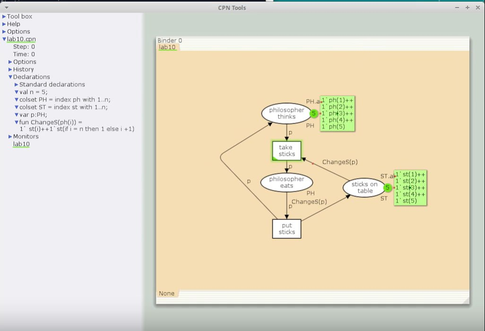
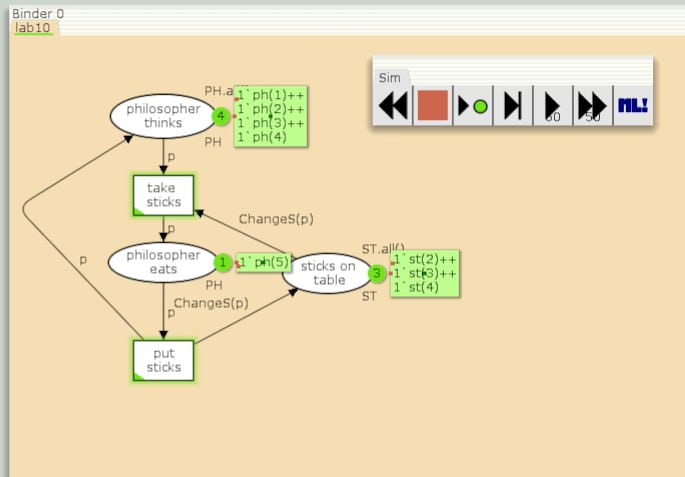
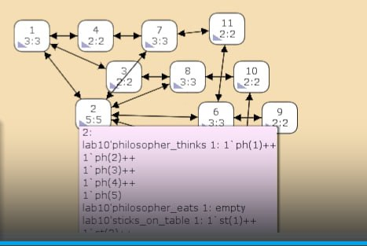
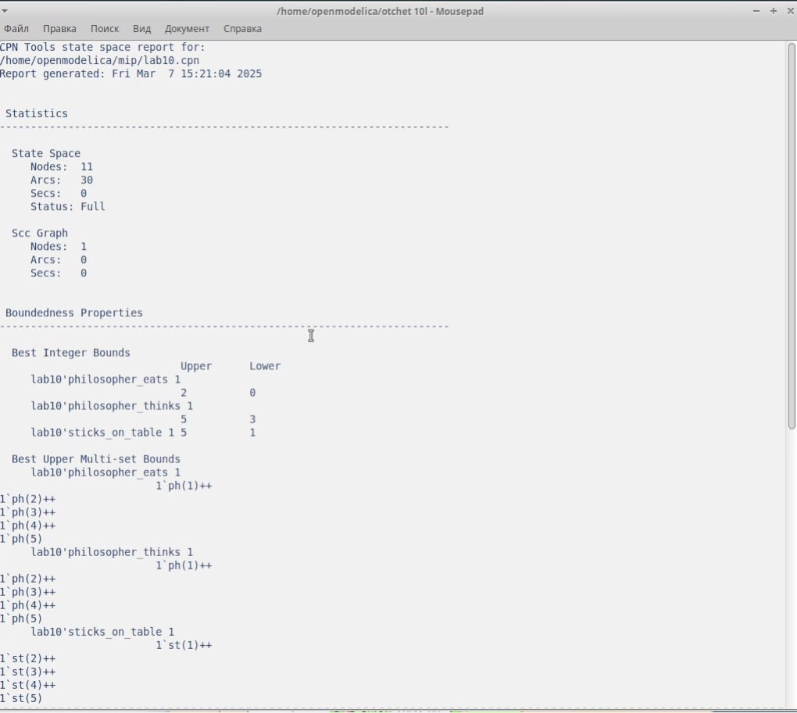

---
## Front matter
title: "Лабораторная работа 10"
subtitle: "Имитационное моделирование"
author: "Голощапов Ярослав Вячеславович"

## Generic otions
lang: ru-RU
toc-title: "Содержание"

## Bibliography
bibliography: bib/cite.bib
csl: pandoc/csl/gost-r-7-0-5-2008-numeric.csl

## Pdf output format
toc: true # Table of contents
toc-depth: 2
lof: true # List of figures
lot: true # List of tables
fontsize: 12pt
linestretch: 1.5
papersize: a4
documentclass: scrreprt
## I18n polyglossia
polyglossia-lang:
  name: russian
  options:
	- spelling=modern
	- babelshorthands=true
polyglossia-otherlangs:
  name: english
## I18n babel
babel-lang: russian
babel-otherlangs: english
## Fonts
mainfont: IBM Plex Serif
romanfont: IBM Plex Serif
sansfont: IBM Plex Sans
monofont: IBM Plex Mono
mathfont: STIX Two Math
mainfontoptions: Ligatures=Common,Ligatures=TeX,Scale=0.94
romanfontoptions: Ligatures=Common,Ligatures=TeX,Scale=0.94
sansfontoptions: Ligatures=Common,Ligatures=TeX,Scale=MatchLowercase,Scale=0.94
monofontoptions: Scale=MatchLowercase,Scale=0.94,FakeStretch=0.9
mathfontoptions:
## Biblatex
biblatex: true
biblio-style: "gost-numeric"
biblatexoptions:
  - parentracker=true
  - backend=biber
  - hyperref=auto
  - language=auto
  - autolang=other*
  - citestyle=gost-numeric
## Pandoc-crossref LaTeX customization
figureTitle: "Рис."
tableTitle: "Таблица"
listingTitle: "Листинг"
lofTitle: "Список иллюстраций"
lotTitle: "Список таблиц"
lolTitle: "Листинги"
## Misc options
indent: true
header-includes:
  - \usepackage{indentfirst}
  - \usepackage{float} # keep figures where there are in the text
  - \floatplacement{figure}{H} # keep figures where there are in the text
---

# Цель работы

Решить задачу об обедающих мудрецах

# Выполнение лабораторной работы

Граф модели с новыми декларациями (рис. [-@fig:001])

{#fig:001 width=70%}

Запуск симуляции. Исходя из этого можем увидеть, что одновременно палочками могут пользоваться только 2 мудреца из 5 (рис. [-@fig:002]) 

{#fig:002 width=70%}

Граф пространства состояний (рис. [-@fig:003])

{#fig:003 width=70%}

Вывод отчета пространства состояний:
есть 11 состояний и 30 переходов между ними.
Затем указаны границы значений для каждого элемента: думающие мудрецы (максимум - 5, минимум - 3), мудрецы едят (максимум - 2, минимум - 0), палочки на столе (максимум - 5, минимум - 1, минимальное значение 2, так как в конце симуляции остаются пирожки).
Также указаны границы в виде мультимножеств.
Маркировка home для всех состояний, так как в любую позицию мы можем попасть из любой другой маркировки.
Маркировка dead равная None, так как нет состояний, из которых переходов быть не может.
В конце указано, что бесконечно часто происходят события положить и взять палочку. (рис. [-@fig:004])

{#fig:004 width=70%}

# Выводы

В этой лабораторной работе я научился решать задачу об обедающих мудрецах

