---
## Front matter
lang: ru-RU
title: Лабораторная работа 11
subtitle: Имитационное моделирование
author:
  - Голощапов Ярослав Вячеславович
institute:
  - Российский университет дружбы народов, Москва, Россия
date: 10 марта 2025

## i18n babel
babel-lang: russian
babel-otherlangs: english

## Formatting pdf
toc: false
toc-title: Содержание
slide_level: 2
aspectratio: 169
section-titles: true
theme: metropolis
header-includes:
 - \metroset{progressbar=frametitle,sectionpage=progressbar,numbering=fraction}
---

# Информация

## Докладчик

:::::::::::::: {.columns align=center}
::: {.column width="70%"}

  * Голощапов Ярослав Вячеславович
  * студент 3 курса
  * Российский университет дружбы народов
  * [1132222003@pfur.ru](mailto:1132222003@pfur.ru)
  * <https://yvgoloschapov.github.io/ru/>

:::
::: {.column width="30%"}

:::
::::::::::::::

## Цель работы

Построение модели системы массового обслуживания M |M |1

## Задание

В систему поступает поток заявок двух типов, распределённый по пуассоновскому
закону. Заявки поступают в очередь сервера на обработку. Дисциплина очереди -
FIFO. Если сервер находится в режиме ожидания (нет заявок на сервере), то заявка
поступает на обработку сервером.

# Выполнение лабораторной работы

## 

1. Будем использовать три отдельных листа: на первом листе опишем граф системы
 , на втором — генератор заявок , на третьем — сервер обработки
заявок .
1.1 Сеть имеет 2 позиции (очередь — Queue, обслуженные заявки — Complited)
и два перехода (генерировать заявку — Arrivals, передать заявку на обработку сер-
веру — Server). Переходы имеют сложную иерархическую структуру, задаваемую
на отдельных листах модели (с помощью соответствующего инструмента меню —
Hierarchy).

##

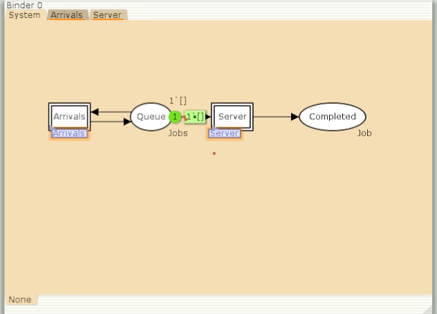{#fig:002 width=70%}

##

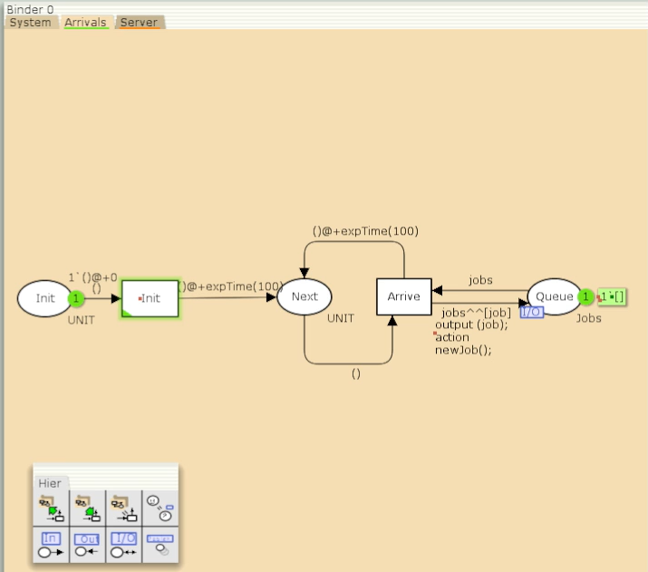{#fig:003 width=70%}

##

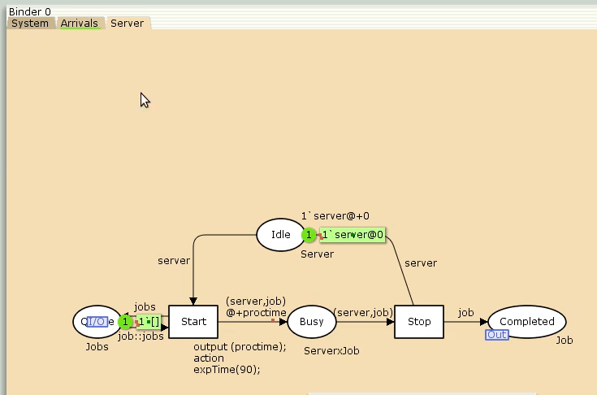{#fig:004 width=70%}

## Записали новые декларации . 

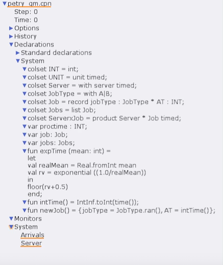{#fig:001 width=70%}

## Запускаем симуляцию

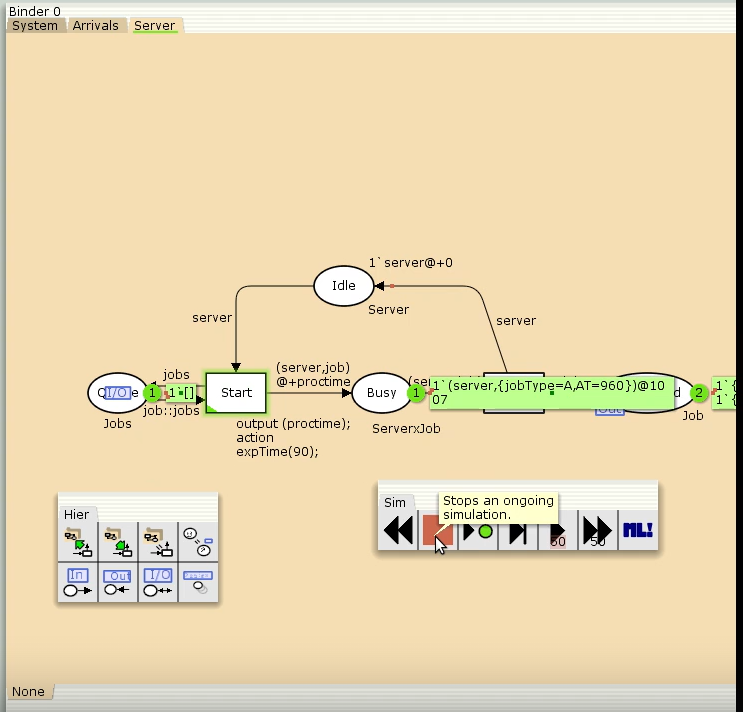{#fig:005 width=70%}

## Создаем 2 новых подраздела в Monitor - Ostanovka и Queue_Delay 

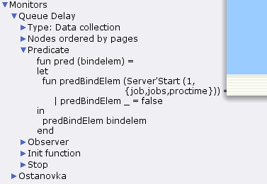{#fig:006 width=70%}

## Запуск симуляции с новыми подразделами 

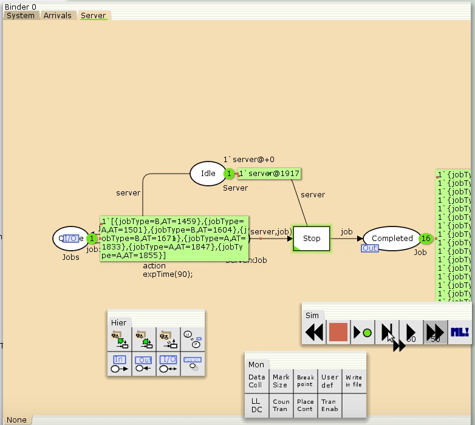{#fig:007 width=70%}

## Вывод с файла Queue_Delay.

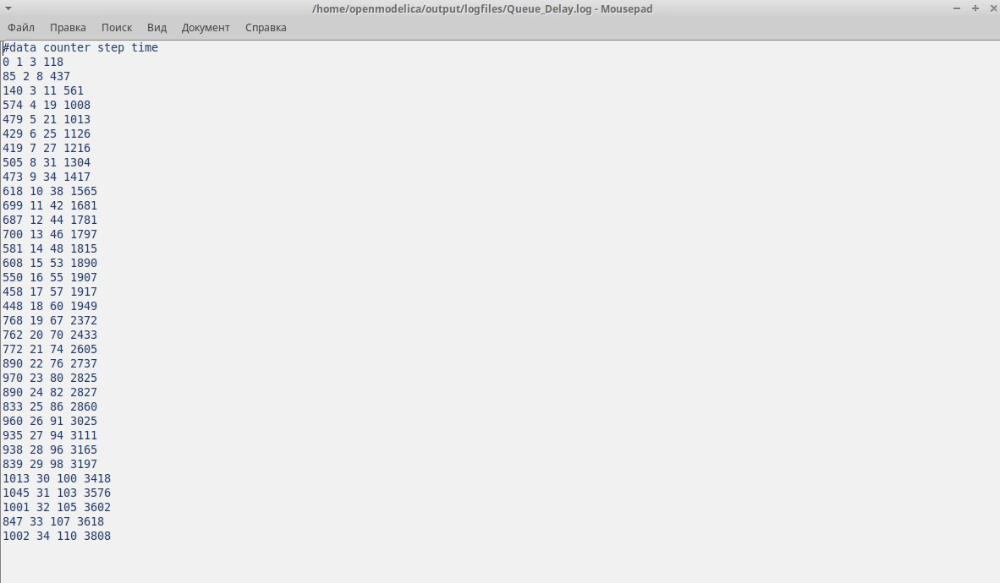{#fig:008 width=70%}

## Код в gnuplot .

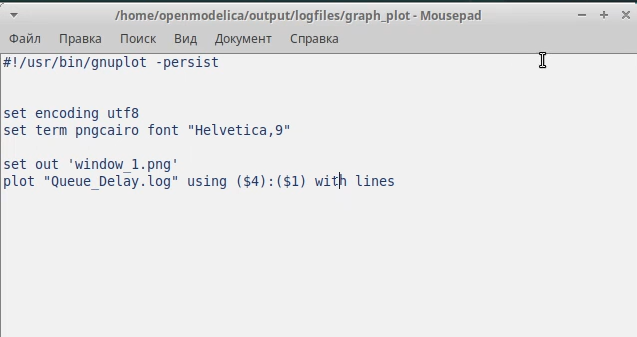{#fig:009 width=70%}

## Вывод графика в  gnuplot 

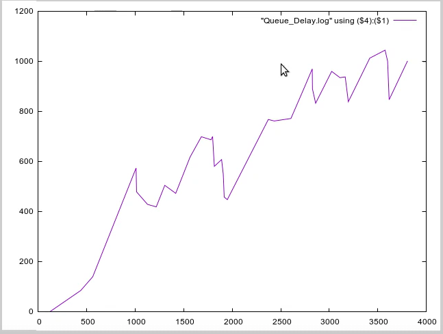{#fig:010 width=70%}

## Добавили новый подраздел Queue Delay Real 

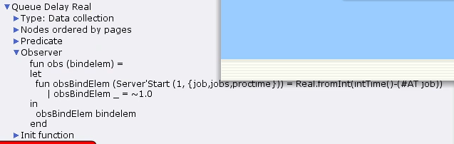{#fig:011 width=70%}

## Содержимое файла  Queue Delay Real 

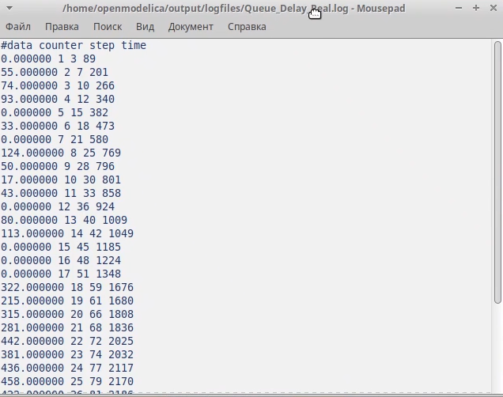{#fig:012 width=70%}

## Добавили новый подраздел Long Delay Time 

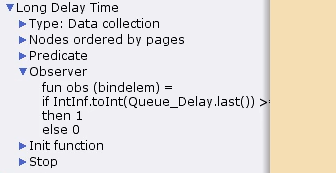{#fig:013 width=70%}

## Содержимое файла Long Delay Time 

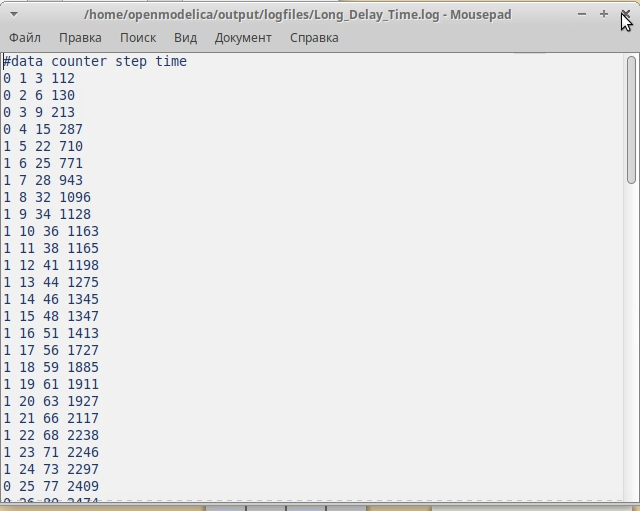{#fig:014 width=70%}

## Изменили немного код и вывели график в gnuplot

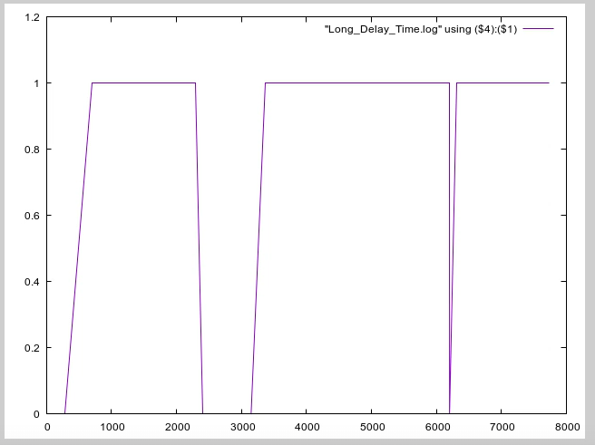{#fig:015 width=70%}

## Выводы

В этой лабораторной работе я приобрел навыки построения модели системы массового обслуживания M |M |1
