---
## Front matter
title: "Лабораторная работа 11"
subtitle: "Имитационное моделирование"
author: "Голощапов Ярослав Вячеславович"

## Generic otions
lang: ru-RU
toc-title: "Содержание"

## Bibliography
bibliography: bib/cite.bib
csl: pandoc/csl/gost-r-7-0-5-2008-numeric.csl

## Pdf output format
toc: true # Table of contents
toc-depth: 2
lof: true # List of figures
lot: true # List of tables
fontsize: 12pt
linestretch: 1.5
papersize: a4
documentclass: scrreprt
## I18n polyglossia
polyglossia-lang:
  name: russian
  options:
	- spelling=modern
	- babelshorthands=true
polyglossia-otherlangs:
  name: english
## I18n babel
babel-lang: russian
babel-otherlangs: english
## Fonts
mainfont: IBM Plex Serif
romanfont: IBM Plex Serif
sansfont: IBM Plex Sans
monofont: IBM Plex Mono
mathfont: STIX Two Math
mainfontoptions: Ligatures=Common,Ligatures=TeX,Scale=0.94
romanfontoptions: Ligatures=Common,Ligatures=TeX,Scale=0.94
sansfontoptions: Ligatures=Common,Ligatures=TeX,Scale=MatchLowercase,Scale=0.94
monofontoptions: Scale=MatchLowercase,Scale=0.94,FakeStretch=0.9
mathfontoptions:
## Biblatex
biblatex: true
biblio-style: "gost-numeric"
biblatexoptions:
  - parentracker=true
  - backend=biber
  - hyperref=auto
  - language=auto
  - autolang=other*
  - citestyle=gost-numeric
## Pandoc-crossref LaTeX customization
figureTitle: "Рис."
tableTitle: "Таблица"
listingTitle: "Листинг"
lofTitle: "Список иллюстраций"
lotTitle: "Список таблиц"
lolTitle: "Листинги"
## Misc options
indent: true
header-includes:
  - \usepackage{indentfirst}
  - \usepackage{float} # keep figures where there are in the text
  - \floatplacement{figure}{H} # keep figures where there are in the text
---

# Цель работы

Построение модели системы массового обслуживания M |M |1

# Задание

В систему поступает поток заявок двух типов, распределённый по пуассоновскому
закону. Заявки поступают в очередь сервера на обработку. Дисциплина очереди -
FIFO. Если сервер находится в режиме ожидания (нет заявок на сервере), то заявка
поступает на обработку сервером.

# Выполнение лабораторной работы

1. Будем использовать три отдельных листа: на первом листе опишем граф системы
(рис. [-@fig:002]) , на втором — генератор заявок (рис. [-@fig:003]), на третьем — сервер обработки
заявок (рис. [-@fig:004]).
1.1 Сеть имеет 2 позиции (очередь — Queue, обслуженные заявки — Complited)
и два перехода (генерировать заявку — Arrivals, передать заявку на обработку сер-
веру — Server). Переходы имеют сложную иерархическую структуру, задаваемую
на отдельных листах модели (с помощью соответствующего инструмента меню —
Hierarchy).

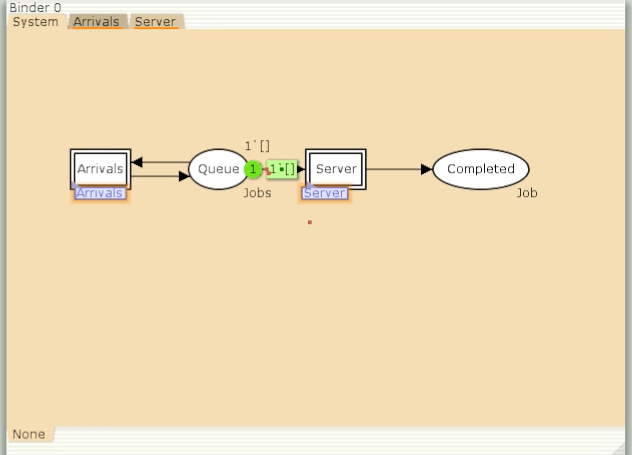{#fig:002 width=70%}

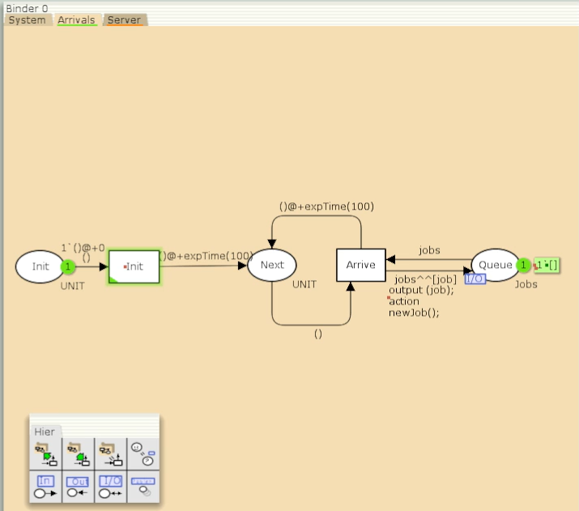{#fig:003 width=70%}

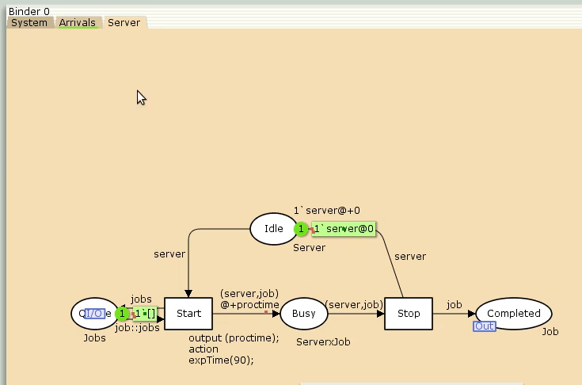{#fig:004 width=70%}

Записали новые декларации (рис. [-@fig:001]). 

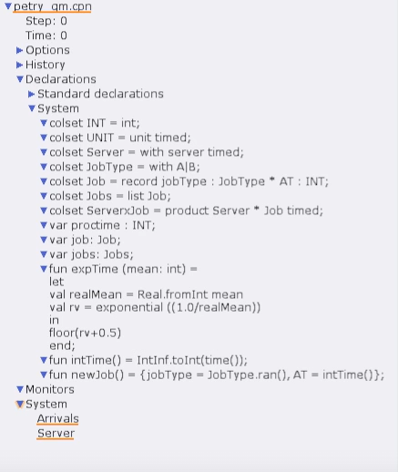{#fig:001 width=70%}

Запускаем симуляцию(рис. [-@fig:005])

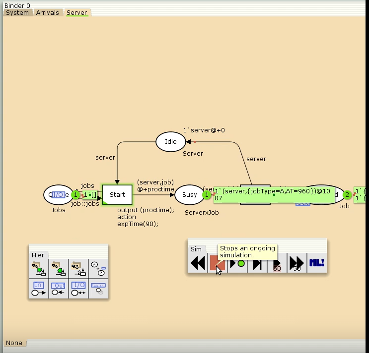{#fig:005 width=70%}

Создаем 2 новых подраздела в Monitor - Ostanovka и Queue_Delay (рис. [-@fig:006])

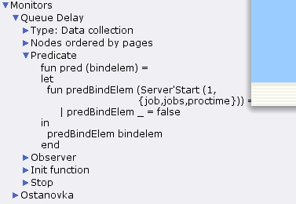{#fig:006 width=70%}

Запуск симуляции с новыми подразделами (рис. [-@fig:007])

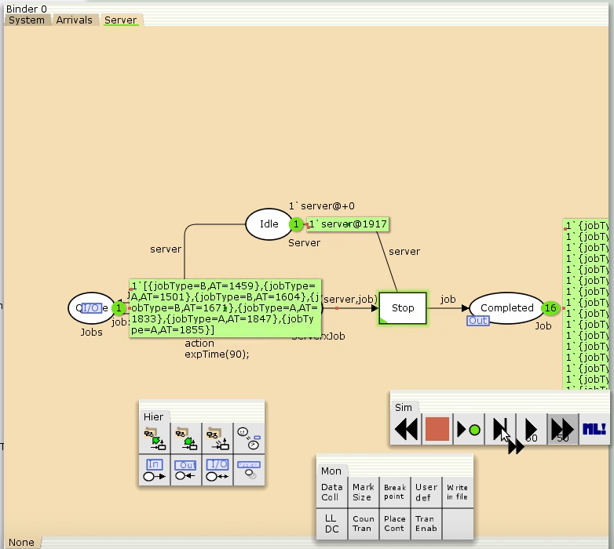{#fig:007 width=70%}

Вывод с файла Queue_Delay(рис. [-@fig:008]).

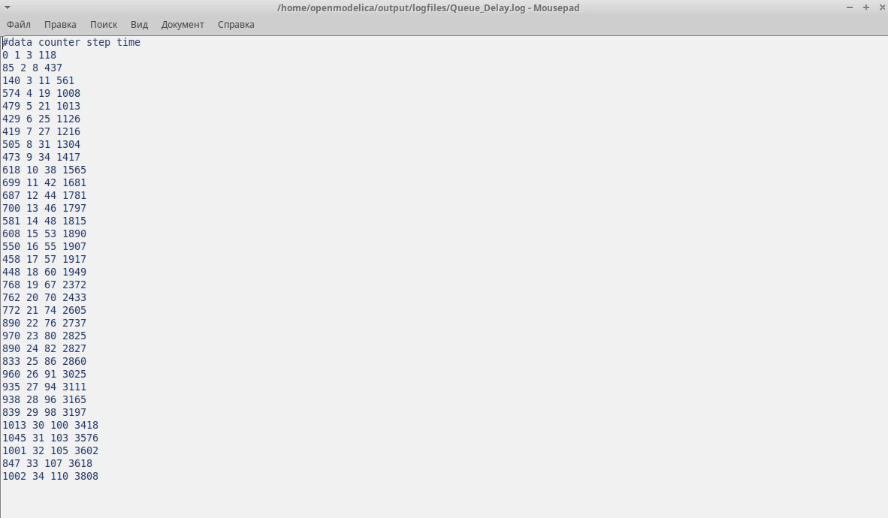{#fig:008 width=70%}

Код в gnuplot (рис. [-@fig:009]).

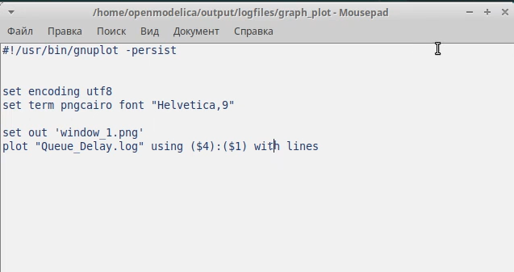{#fig:009 width=70%}

Вывод графика в  gnuplot (рис. [-@fig:010])

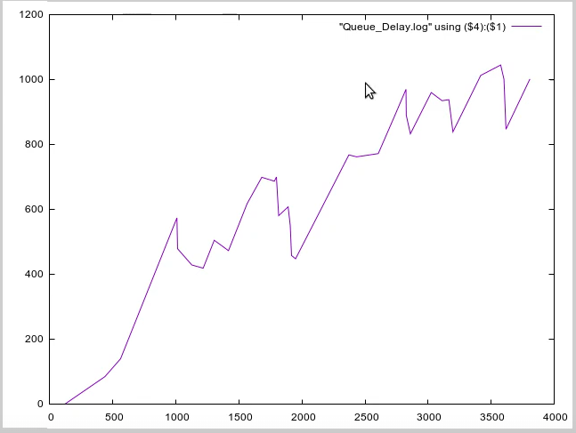{#fig:010 width=70%}

Добавили новый подраздел Queue Delay Real (рис. [-@fig:011])

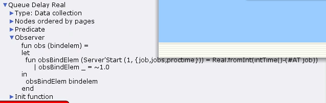{#fig:011 width=70%}

Содержимое файла  Queue Delay Real (рис. [-@fig:012])

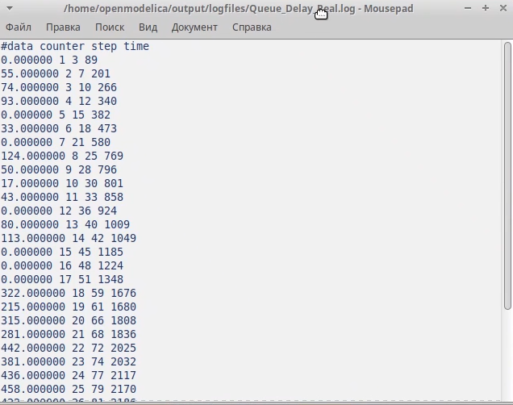{#fig:012 width=70%}

Добавили новый подраздел Long Delay Time (рис. [-@fig:013])

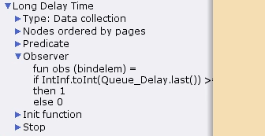{#fig:013 width=70%}

Содержимое файла Long Delay Time (рис. [-@fig:014])

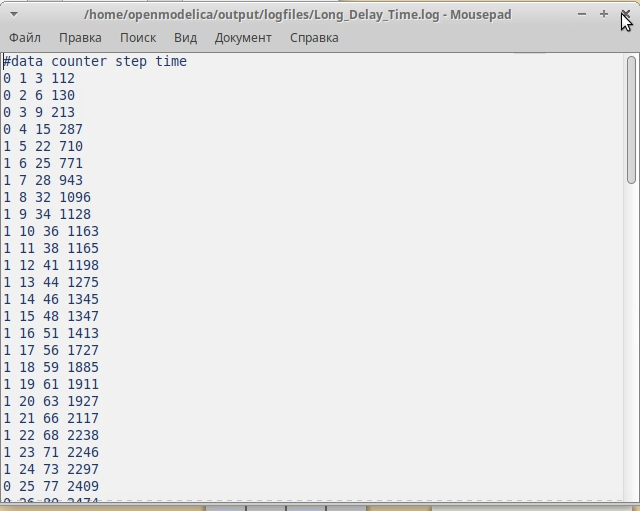{#fig:014 width=70%}

Изменили немного код и вывели график в gnuplot(рис. [-@fig:015])

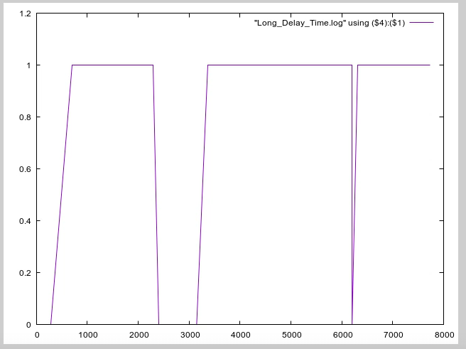{#fig:015 width=70%}

# Выводы

В этой лабораторной работе я приобрел навыки построения модели системы массового обслуживания M |M |1

