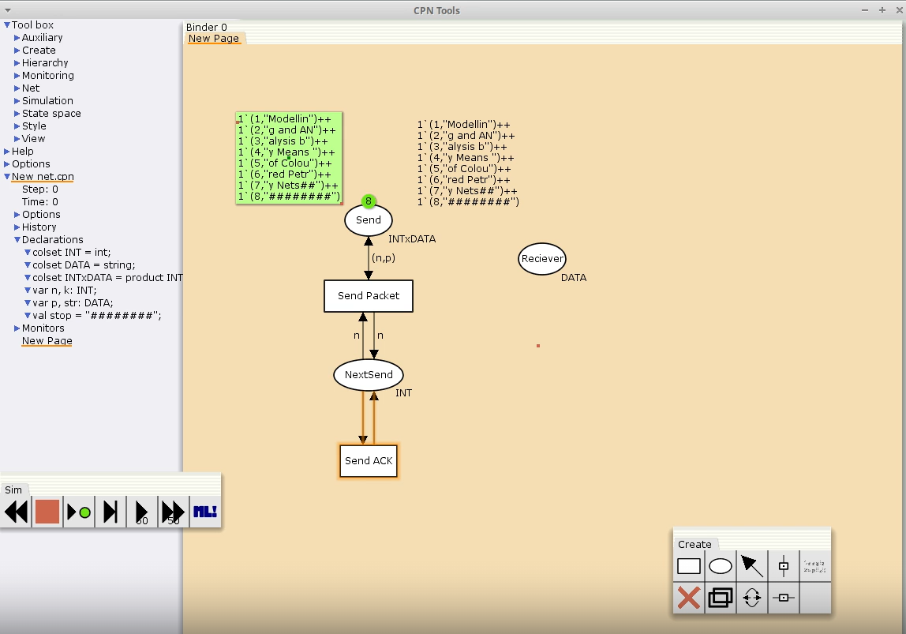
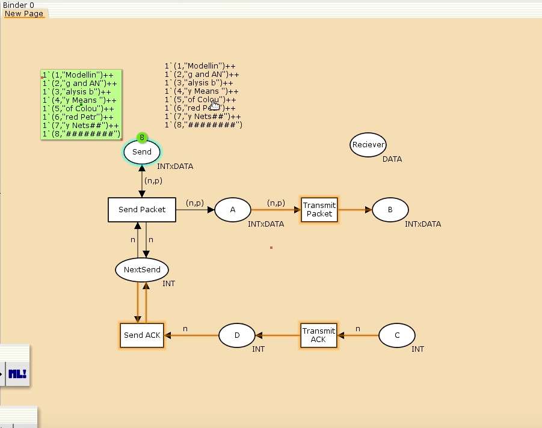
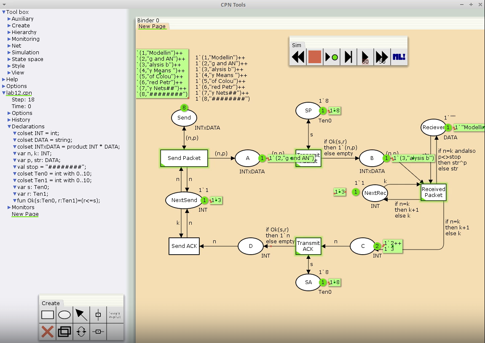
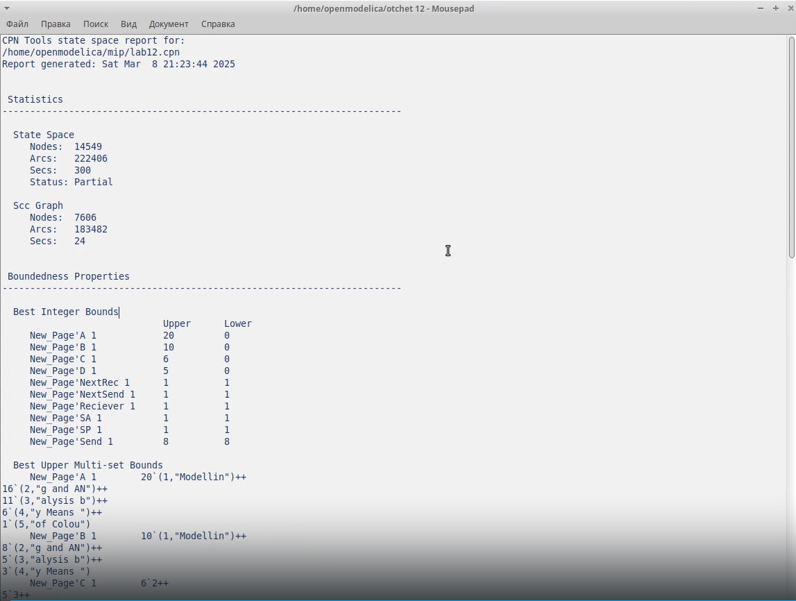
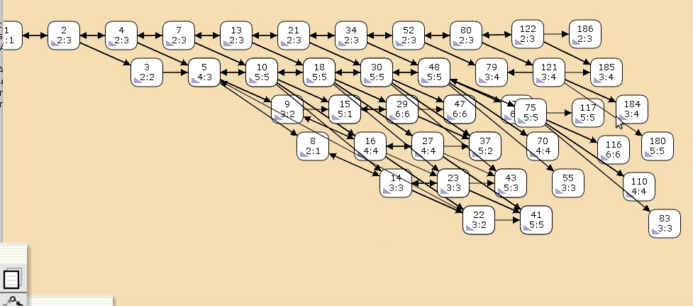

---
## Front matter
lang: ru-RU
title: Лабораторная работа 12
subtitle: Имитационное моделирование
author:
  - Голощапов Ярослав Вячеславович
institute:
  - Российский университет дружбы народов, Москва, Россия
date: 10 марта 2025

## i18n babel
babel-lang: russian
babel-otherlangs: english

## Formatting pdf
toc: false
toc-title: Содержание
slide_level: 2
aspectratio: 169
section-titles: true
theme: metropolis
header-includes:
 - \metroset{progressbar=frametitle,sectionpage=progressbar,numbering=fraction}
---

# Информация

## Докладчик

:::::::::::::: {.columns align=center}
::: {.column width="70%"}

  * Голощапов Ярослав Вячеславович
  * студент 3 курса
  * Российский университет дружбы народов
  * [1132222003@pfur.ru](mailto:1132222003@pfur.ru)
  * <https://yvgoloschapov.github.io/ru/>

:::
::: {.column width="30%"}

:::
::::::::::::::

## Цель работы

Построение модели простого протокола передачи данных

## Задание

Рассмотрим ненадёжную сеть передачи данных, состоящую из источника, получателя.
Перед отправкой очередной порции данных источник должен получить от получателя подтверждение о доставке предыдущей порции данных.
Считаем, что пакет состоит из номера пакета и строковых данных. Передавать
будем сообщение «Modelling and Analysis by Means of Coloured Petry Nets», разбитое
по 8 символов.

# Выполнение лабораторной работы

##

Основные состояния: источник (Send), получатель (Receiver).
Действия (переходы): отправить пакет (Send Packet), отправить подтверждение
(Send ACK).
Промежуточное состояние: следующий посылаемый пакет (NextSend).

## Создаем начальный граф вместе с декларациями . 

{#fig:001 width=70%}

##

Зададим промежуточные состояния (A, B с типом INTxDATA, C, D с типом
INTxDATA) для переходов (рис. 12.2): передать пакет Transmit Packet (передаём
(n,p)), передать подтверждение Transmit ACK (передаём целое число k).
Добавляем переход получения пакета (Receive Packet).
От состояния Receiver идёт дуга к переходу Receive Packet со значением той
строки (str), которая находится в состоянии Receiver. Обратно: проверяем, что
номер пакета новый и строка не равна стоп-биту. Если это так, то строку добавляем
к полученным данным.
Кроме того, необходимо знать, каким будет номер следующего пакета. Для этого
добавляем состояние NextRec с типом INT и начальным значением 1`1 (один пакет),
связываем его дугами с переходом Receive Packet. Причём к переходу идёт дуга
с выражением k, от перехода — if n=k then k+1 else k.
Связываем состояния B и C с переходом Receive Packet. От состояния B
к переходу Receive Packet — выражение (n,p), от перехода Receive Packet
к состоянию C — выражение if n=k then k+1 else k.
От перехода Receive Packet к состоянию Receiver:
if n=k andalso p<>stop then str^p else str 

##

{#fig:002 width=70%}

## Создаем конечный граф

{#fig:003 width=70%}

## Выводим отчёт о пространстве состояний .

{#fig:004 width=70%}

## Строим граф пространства состояний

{#fig:005 width=70%}

## Выводы

В этой лабораторной работе я приобрел навыки построения модели простого протокола передачи данных
