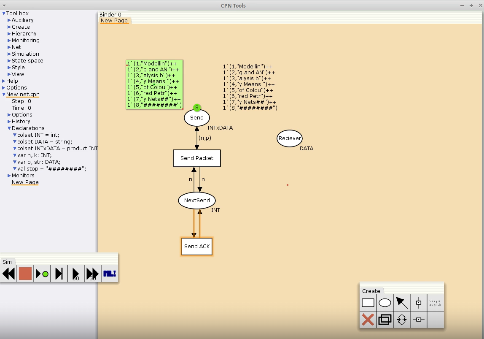

---
## Front matter
title: "Лабораторная работа 12"
subtitle: "Имитационное моделирование"
author: "Голощапов Ярослав Вячеславович"

## Generic otions
lang: ru-RU
toc-title: "Содержание"

## Bibliography
bibliography: bib/cite.bib
csl: pandoc/csl/gost-r-7-0-5-2008-numeric.csl

## Pdf output format
toc: true # Table of contents
toc-depth: 2
lof: true # List of figures
lot: true # List of tables
fontsize: 12pt
linestretch: 1.5
papersize: a4
documentclass: scrreprt
## I18n polyglossia
polyglossia-lang:
  name: russian
  options:
	- spelling=modern
	- babelshorthands=true
polyglossia-otherlangs:
  name: english
## I18n babel
babel-lang: russian
babel-otherlangs: english
## Fonts
mainfont: IBM Plex Serif
romanfont: IBM Plex Serif
sansfont: IBM Plex Sans
monofont: IBM Plex Mono
mathfont: STIX Two Math
mainfontoptions: Ligatures=Common,Ligatures=TeX,Scale=0.94
romanfontoptions: Ligatures=Common,Ligatures=TeX,Scale=0.94
sansfontoptions: Ligatures=Common,Ligatures=TeX,Scale=MatchLowercase,Scale=0.94
monofontoptions: Scale=MatchLowercase,Scale=0.94,FakeStretch=0.9
mathfontoptions:
## Biblatex
biblatex: true
biblio-style: "gost-numeric"
biblatexoptions:
  - parentracker=true
  - backend=biber
  - hyperref=auto
  - language=auto
  - autolang=other*
  - citestyle=gost-numeric
## Pandoc-crossref LaTeX customization
figureTitle: "Рис."
tableTitle: "Таблица"
listingTitle: "Листинг"
lofTitle: "Список иллюстраций"
lotTitle: "Список таблиц"
lolTitle: "Листинги"
## Misc options
indent: true
header-includes:
  - \usepackage{indentfirst}
  - \usepackage{float} # keep figures where there are in the text
  - \floatplacement{figure}{H} # keep figures where there are in the text
---

# Цель работы

Построение модели простого протокола передачи данных

# Задание

Рассмотрим ненадёжную сеть передачи данных, состоящую из источника, получателя.
Перед отправкой очередной порции данных источник должен получить от получателя подтверждение о доставке предыдущей порции данных.
Считаем, что пакет состоит из номера пакета и строковых данных. Передавать
будем сообщение «Modelling and Analysis by Means of Coloured Petry Nets», разбитое
по 8 символов.

# Выполнение лабораторной работы

Основные состояния: источник (Send), получатель (Receiver).
Действия (переходы): отправить пакет (Send Packet), отправить подтверждение
(Send ACK).
Промежуточное состояние: следующий посылаемый пакет (NextSend).

Создаем начальный граф вместе с декларациями (рис. [-@fig:001]). 

{#fig:001 width=70%}

Зададим промежуточные состояния (A, B с типом INTxDATA, C, D с типом
INTxDATA) для переходов (рис. 12.2): передать пакет Transmit Packet (передаём
(n,p)), передать подтверждение Transmit ACK (передаём целое число k).
Добавляем переход получения пакета (Receive Packet).
От состояния Receiver идёт дуга к переходу Receive Packet со значением той
строки (str), которая находится в состоянии Receiver. Обратно: проверяем, что
номер пакета новый и строка не равна стоп-биту. Если это так, то строку добавляем
к полученным данным.
Кроме того, необходимо знать, каким будет номер следующего пакета. Для этого
добавляем состояние NextRec с типом INT и начальным значением 1`1 (один пакет),
связываем его дугами с переходом Receive Packet. Причём к переходу идёт дуга
с выражением k, от перехода — if n=k then k+1 else k.
Связываем состояния B и C с переходом Receive Packet. От состояния B
к переходу Receive Packet — выражение (n,p), от перехода Receive Packet
к состоянию C — выражение if n=k then k+1 else k.
От перехода Receive Packet к состоянию Receiver:
if n=k andalso p<>stop then str^p else str  (рис. [-@fig:002]) 

{#fig:002 width=70%}

Создаем конечный граф(рис. [-@fig:003])

{#fig:003 width=70%}

Выводим отчёт о пространстве состояний (рис. [-@fig:004]).

{#fig:004 width=70%}

Строим граф пространства состояний(рис. [-@fig:005])

{#fig:005 width=70%}

# Выводы

В этой лабораторной работе я приобрел навыки построения модели простого протокола передачи данных
