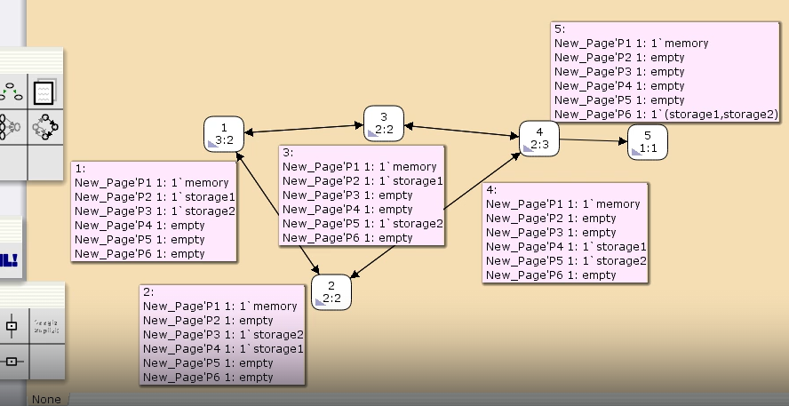

---
## Front matter
title: "Лабораторная работа 13"
subtitle: "Имитационное моделирование"
author: "Голощапов Ярослав Вячеславович"

## Generic otions
lang: ru-RU
toc-title: "Содержание"

## Bibliography
bibliography: bib/cite.bib
csl: pandoc/csl/gost-r-7-0-5-2008-numeric.csl

## Pdf output format
toc: true # Table of contents
toc-depth: 2
lof: true # List of figures
lot: true # List of tables
fontsize: 12pt
linestretch: 1.5
papersize: a4
documentclass: scrreprt
## I18n polyglossia
polyglossia-lang:
  name: russian
  options:
	- spelling=modern
	- babelshorthands=true
polyglossia-otherlangs:
  name: english
## I18n babel
babel-lang: russian
babel-otherlangs: english
## Fonts
mainfont: IBM Plex Serif
romanfont: IBM Plex Serif
sansfont: IBM Plex Sans
monofont: IBM Plex Mono
mathfont: STIX Two Math
mainfontoptions: Ligatures=Common,Ligatures=TeX,Scale=0.94
romanfontoptions: Ligatures=Common,Ligatures=TeX,Scale=0.94
sansfontoptions: Ligatures=Common,Ligatures=TeX,Scale=MatchLowercase,Scale=0.94
monofontoptions: Scale=MatchLowercase,Scale=0.94,FakeStretch=0.9
mathfontoptions:
## Biblatex
biblatex: true
biblio-style: "gost-numeric"
biblatexoptions:
  - parentracker=true
  - backend=biber
  - hyperref=auto
  - language=auto
  - autolang=other*
  - citestyle=gost-numeric
## Pandoc-crossref LaTeX customization
figureTitle: "Рис."
tableTitle: "Таблица"
listingTitle: "Листинг"
lofTitle: "Список иллюстраций"
lotTitle: "Список таблиц"
lolTitle: "Листинги"
## Misc options
indent: true
header-includes:
  - \usepackage{indentfirst}
  - \usepackage{float} # keep figures where there are in the text
  - \floatplacement{figure}{H} # keep figures where there are in the text
---

# Цель работы

Выполнить задание для самостоятельной работы

# Задание

1. Используя теоретические методы анализа сетей Петри, проведите анализ сети. Определите, является ли сеть безопасной, ограниченной, сохраняющей, имеются ли
тупики.
2. Промоделируйте сеть Петри с помощью CPNTools.
3. Вычислите пространство состояний. Сформируйте отчёт о пространстве состояний и проанализируйте его. Постройте граф пространства состояний.

# Выполнение лабораторной работы

Сеть Петри моделируемой системы представлена на рис. 13.2.
Множество позиций:
P1 — состояние оперативной памяти (свободна / занята);
P2 — состояние внешнего запоминающего устройства B1 (свободно / занято);
P3 — состояние внешнего запоминающего устройства B2 (свободно / занято);
P4 — работа на ОП и B1 закончена;
P5 — работа на ОП и B2 закончена;
P6 — работа на ОП, B1 и B2 закончена;
Множество переходов: 
T1 — ЦП работает только с RAM и B1;
T2 — обрабатываются данные из RAM и с B1 переходят на устройство вывода;
T3 — CPU работает только с RAM и B2;
T4 — обрабатываются данные из RAM и с B2 переходят на устройство вывода;
T5 — CPU работает только с RAM и с B1, B2;
T6 — обрабатываются данные из RAM, B1, B2 и переходят на устройство вывода.

Функционирование сети Петри можно расматривать как срабатывание переходов,
в ходе которого происходит перемещение маркеров по позициям:
– работа CPU с RAM и B1 отображается запуском перехода T1 (удаление маркеров
из P1, P2 и появление в P1, P4), что влечет за собой срабатывание перехода T2,
т.е. передачу данных с RAM и B1 на устройство вывода;
– работа CPU с RAM и B2 отображается запуском перехода T3 (удаление маркеров
из P1 и P3 и появление в P1 и P5), что влечет за собой срабатывание перехода T4,
т.е. передачу данных с RAM и B2 на устройство вывода;
– работа CPU с RAM, B1 и B2 отображается запуском перехода T5 (удаление
маркеров из P4 и P5 и появление в P6), далее срабатывание перехода T6, и данные
из RAM, B1 и B2 передаются на устройство вывода;
– состояние устройств восстанавливается при срабатывании: RAM — переходов
T1 или T2; B1 — переходов T2 или T6; B2 — переходов T4 или T6.

Построение сети Петри (рис. [-@fig:001]). 

{#fig:001 width=70%}

Запускаем симуляцию (рис. [-@fig:002]) 

{#fig:002 width=70%}

Выводим отчёт о пространстве состояний (рис. [-@fig:003])

{#fig:003 width=70%}

Строим граф пространства состояний (рис. [-@fig:004]).

{#fig:004 width=70%}

# Выводы

В этой лабораторной работе я выполнил задание для самостоятельной работы
