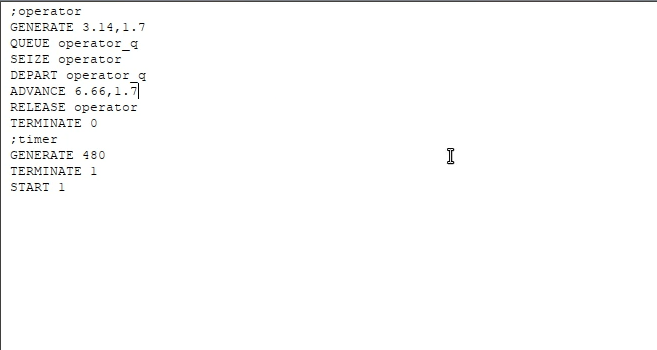

---
## Front matter
lang: ru-RU
title: Лабораторная работа 14
subtitle: Имитационное моделирование
author:
  - Голощапов Ярослав Вячеславович
institute:
  - Российский университет дружбы народов, Москва, Россия
date: 10 марта 2025

## i18n babel
babel-lang: russian
babel-otherlangs: english

## Formatting pdf
toc: false
toc-title: Содержание
slide_level: 2
aspectratio: 169
section-titles: true
theme: metropolis
header-includes:
 - \metroset{progressbar=frametitle,sectionpage=progressbar,numbering=fraction}
---

# Информация

## Докладчик

:::::::::::::: {.columns align=center}
::: {.column width="70%"}

  * Голощапов Ярослав Вячеславович
  * студент 3 курса
  * Российский университет дружбы народов
  * [1132222003@pfur.ru](mailto:1132222003@pfur.ru)
  * <https://yvgoloschapov.github.io/ru/>

:::
::: {.column width="30%"}

:::
::::::::::::::

## Цель работы

Построение моделей обработки заказов

## Задание

В интернет-магазине заказы принимает один оператор. Интервалы поступления
заказов распределены равномерно с интервалом 15 ± 4 мин. Время оформления
заказа также распределено равномерно на интервале 10 ± 2 мин. Обработка по-
ступивших заказов происходит в порядке очереди (FIFO). Требуется разработать
модель обработки заказов в течение 8 часов

# Выполнение лабораторной работы

# Модель оформления заказов клиентов одним оператором

##

Порядок блоков в модели соответствует порядку фаз обработки заказа в реальной
системе:
1) клиент оставляет заявку на заказ в интернет-магазине;
2) если необходимо, заявка от клиента ожидает в очереди освобождения оператора
для оформления заказа;
3) заявка от клиента принимается оператором для оформления заказа;
4) оператор оформляет заказ;
5) клиент получает подтверждение об оформлении заказа (покидает систему).

## Модель будет состоять из двух частей: 

моделирование обработки заказов в интернет-магазине и задание времени моделирования. 

{#fig:001 width=70%}

## Запускаем симуляцию и получаем отчёт по модели оформления заказов в интернет-магазине 

{#fig:002 width=70%}

##

**Упражнение** Скорректируйте модель в соответствии с изменениями входных
данных: интервалы поступления заказов распределены равномерно с интервалом
3.14 ± 1.7 мин; время оформления заказа также распределено равномерно на интер-
вале 6.66 ± 1.7 мин. Проанализируйте отчёт, сравнив результаты с результатами
предыдущего моделирования.

## Корректируем модель 

{#fig:003 width=70%}

## Выводим новый отчёт .

{#fig:004 width=70%}

##

Предположим требуется построить гистограмму распределения заявок, ожидаю-
щих обработки в очереди в примере из предыдущего упражнения. Для построения
гистограммы необходимо сформировать таблицу значений заявок в очереди, запи-
сываемых в неё с определённой частотой. 

## Строим модель 

{#fig:005 width=70%}

## Выводим отчет и гистограмму 

{#fig:006 width=70%}

##

{#fig:007 width=70%}

# Модель обслуживания двух типов заказов от клиентов в интернет-магазине

## Строим модель .

{#fig:008 width=70%}

## После запуска симуляции получаем отчёт .

{#fig:009 width=70%}

##

**Упражнение** Скорректируйте модель так, чтобы учитывалось условие, что число
заказов с дополнительным пакетом услуг составляет 30% от общего числа заказов.
Используйте оператор TRANSFER. Проанализируйте отчёт

## Добавление оператора TRANSFER 

{#fig:010 width=70%}

## После запуска симуляции получаем отчёт

{#fig:011 width=70%}

# Модель оформления заказов несколькими операторами

## Посторение модели 

{#fig:012 width=70%}

## После запуска симуляции получаем отчёт 

{#fig:013 width=70%}

##

**Задание**
1) Проанализируйте полученный отчёт.
2) Измените модель: требуется учесть в ней возможные отказы клиентов от заказа
— когда при подаче заявки на заказ клиент видит в очереди более двух других
заявок, он отказывается от подачи заявки, то есть отказывается от обслуживания
(используйте блок TEST и стандартный числовой атрибут Qj текущей длины очереди j).
3) Проанализируйте отчёт изменённой модели.

## Изменяем модель 

{#fig:014 width=70%}

## Получаем отчет 

{#fig:015 width=70%}

## Выводы

В этой лабораторной работе я приобрел навыки построения моделей обработки заказов
