---
## Front matter
title: "Лабораторная работа 14"
subtitle: "Имитационное моделирование"
author: "Голощапов Ярослав Вячеславович"

## Generic otions
lang: ru-RU
toc-title: "Содержание"

## Bibliography
bibliography: bib/cite.bib
csl: pandoc/csl/gost-r-7-0-5-2008-numeric.csl

## Pdf output format
toc: true # Table of contents
toc-depth: 2
lof: true # List of figures
lot: true # List of tables
fontsize: 12pt
linestretch: 1.5
papersize: a4
documentclass: scrreprt
## I18n polyglossia
polyglossia-lang:
  name: russian
  options:
	- spelling=modern
	- babelshorthands=true
polyglossia-otherlangs:
  name: english
## I18n babel
babel-lang: russian
babel-otherlangs: english
## Fonts
mainfont: IBM Plex Serif
romanfont: IBM Plex Serif
sansfont: IBM Plex Sans
monofont: IBM Plex Mono
mathfont: STIX Two Math
mainfontoptions: Ligatures=Common,Ligatures=TeX,Scale=0.94
romanfontoptions: Ligatures=Common,Ligatures=TeX,Scale=0.94
sansfontoptions: Ligatures=Common,Ligatures=TeX,Scale=MatchLowercase,Scale=0.94
monofontoptions: Scale=MatchLowercase,Scale=0.94,FakeStretch=0.9
mathfontoptions:
## Biblatex
biblatex: true
biblio-style: "gost-numeric"
biblatexoptions:
  - parentracker=true
  - backend=biber
  - hyperref=auto
  - language=auto
  - autolang=other*
  - citestyle=gost-numeric
## Pandoc-crossref LaTeX customization
figureTitle: "Рис."
tableTitle: "Таблица"
listingTitle: "Листинг"
lofTitle: "Список иллюстраций"
lotTitle: "Список таблиц"
lolTitle: "Листинги"
## Misc options
indent: true
header-includes:
  - \usepackage{indentfirst}
  - \usepackage{float} # keep figures where there are in the text
  - \floatplacement{figure}{H} # keep figures where there are in the text
---

# Цель работы

Построение моделей обработки заказов

# Задание

В интернет-магазине заказы принимает один оператор. Интервалы поступления
заказов распределены равномерно с интервалом 15 ± 4 мин. Время оформления
заказа также распределено равномерно на интервале 10 ± 2 мин. Обработка по-
ступивших заказов происходит в порядке очереди (FIFO). Требуется разработать
модель обработки заказов в течение 8 часов

# Выполнение лабораторной работы
Порядок блоков в модели соответствует порядку фаз обработки заказа в реальной
системе:
1) клиент оставляет заявку на заказ в интернет-магазине;
2) если необходимо, заявка от клиента ожидает в очереди освобождения оператора
для оформления заказа;
3) заявка от клиента принимается оператором для оформления заказа;
4) оператор оформляет заказ;
5) клиент получает подтверждение об оформлении заказа (покидает систему).
Модель будет состоять из двух частей: моделирование обработки заказов
в интернет-магазине и задание времени моделирования. (рис. [-@fig:001]). 

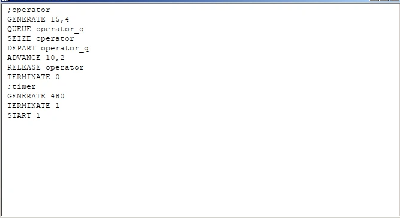{#fig:001 width=70%}

Запускаем симуляцию и получаем отчёт по модели оформления заказов в интернет-магазине(рис. [-@fig:002]) 

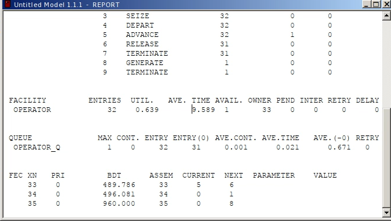{#fig:002 width=70%}

**Упражнение** Скорректируйте модель в соответствии с изменениями входных
данных: интервалы поступления заказов распределены равномерно с интервалом
3.14 ± 1.7 мин; время оформления заказа также распределено равномерно на интер-
вале 6.66 ± 1.7 мин. Проанализируйте отчёт, сравнив результаты с результатами
предыдущего моделирования.

Корректируем модель (рис. [-@fig:003])

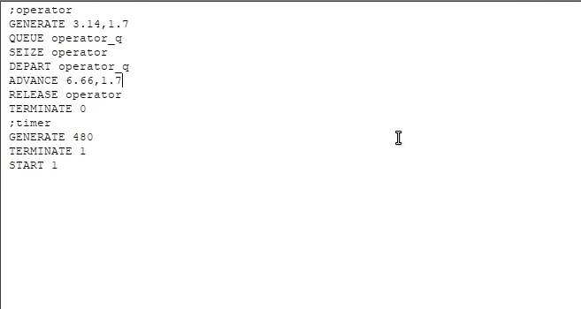{#fig:003 width=70%}

Выводим новый отчёт (рис. [-@fig:004]).

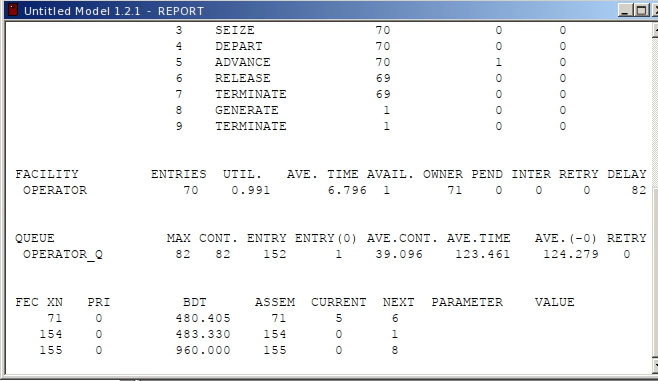{#fig:004 width=70%}

Предположим требуется построить гистограмму распределения заявок, ожидаю-
щих обработки в очереди в примере из предыдущего упражнения. Для построения
гистограммы необходимо сформировать таблицу значений заявок в очереди, запи-
сываемых в неё с определённой частотой. Строим модель (рис. [-@fig:005])

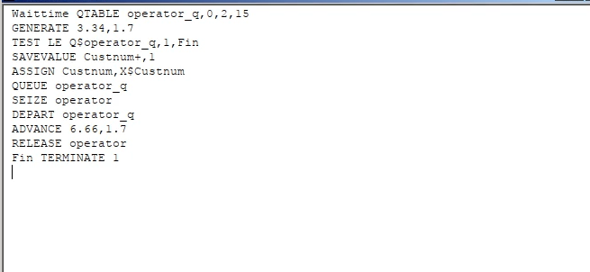{#fig:005 width=70%}

Выводим отчет и гистограмму (рис. [-@fig:006]) (рис. [-@fig:007])

{#fig:006 width=70%}

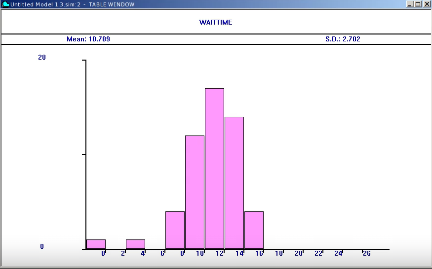{#fig:007 width=70%}

# Модель обслуживания двух типов заказов от клиентов в интернет-магазине

Строим модель (рис. [-@fig:008]).

{#fig:008 width=70%}

После запуска симуляции получаем отчёт (рис. [-@fig:009]).

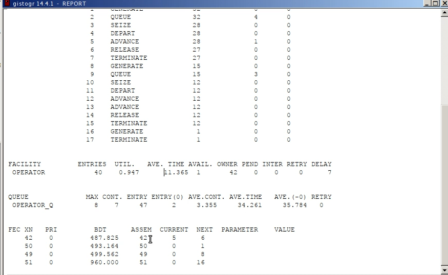{#fig:009 width=70%}

**Упражнение** Скорректируйте модель так, чтобы учитывалось условие, что число
заказов с дополнительным пакетом услуг составляет 30% от общего числа заказов.
Используйте оператор TRANSFER. Проанализируйте отчёт

Добавление оператора TRANSFER (рис. [-@fig:010])

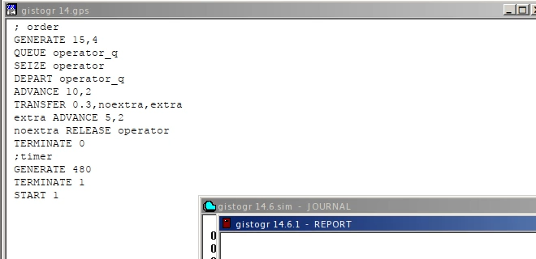{#fig:010 width=70%}

После запуска симуляции получаем отчёт (рис. [-@fig:011])

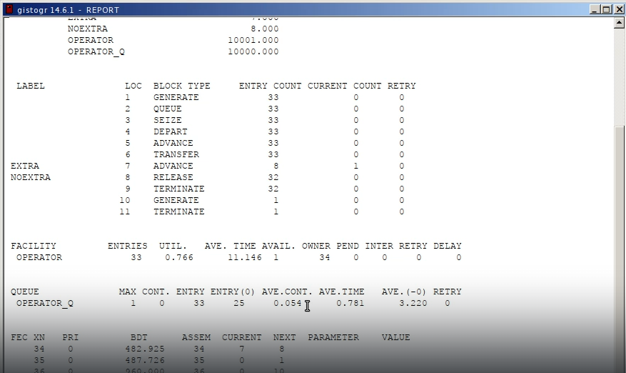{#fig:011 width=70%}

# Модель оформления заказов несколькими операторами

Посторение модели (рис. [-@fig:012])

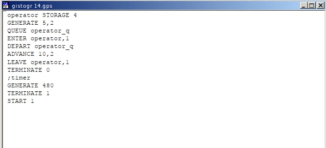{#fig:012 width=70%}

После запуска симуляции получаем отчёт (рис. [-@fig:013])

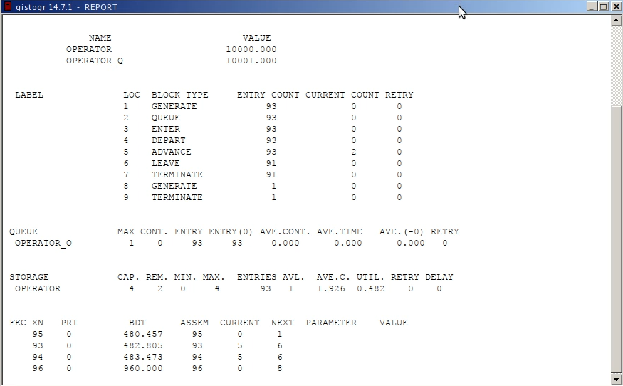{#fig:013 width=70%}

**Задание**
1) Проанализируйте полученный отчёт.
2) Измените модель: требуется учесть в ней возможные отказы клиентов от заказа
— когда при подаче заявки на заказ клиент видит в очереди более двух других
заявок, он отказывается от подачи заявки, то есть отказывается от обслуживания
(используйте блок TEST и стандартный числовой атрибут Qj текущей длины очереди j).
3) Проанализируйте отчёт изменённой модели.

Изменяем модель (рис. [-@fig:014])

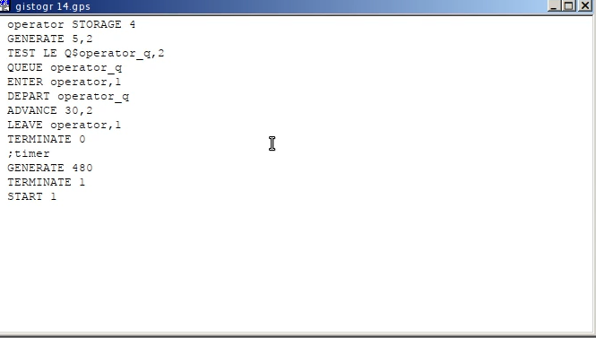{#fig:014 width=70%}

Получаем отчет (рис. [-@fig:015])

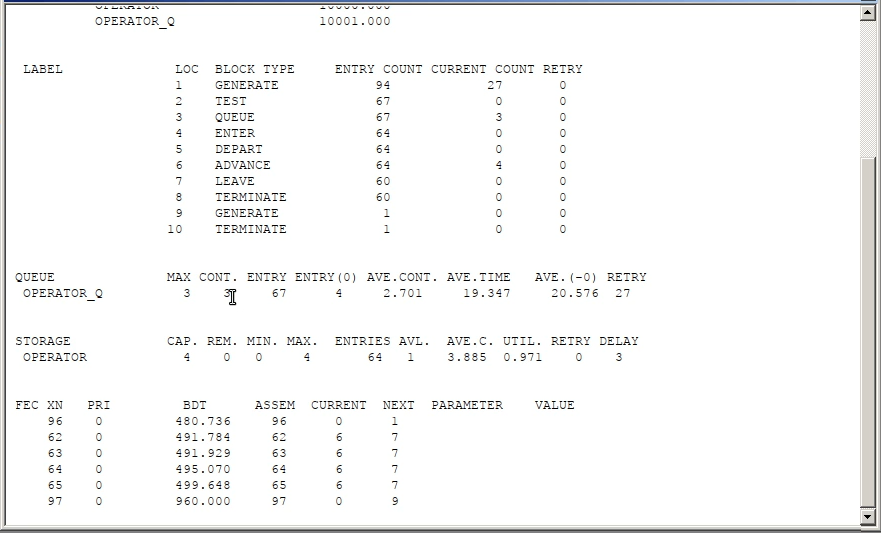{#fig:015 width=70%}

# Выводы

В этой лабораторной работе я приобрел навыки построения моделей обработки заказов

