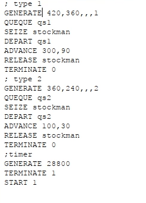
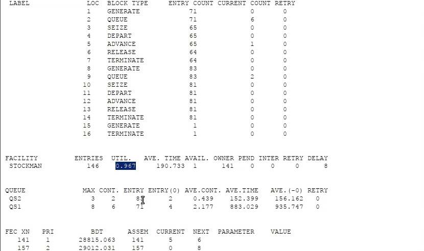
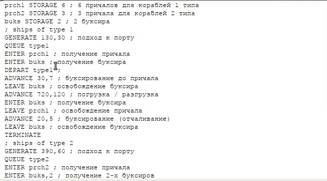
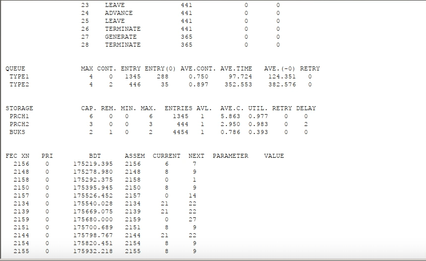

---
## Front matter
lang: ru-RU
title: Лабораторная работа 15
subtitle: Имитационное моделирование
author:
  - Голощапов Ярослав Вячеславович
institute:
  - Российский университет дружбы народов, Москва, Россия
date: 10 марта 2025

## i18n babel
babel-lang: russian
babel-otherlangs: english

## Formatting pdf
toc: false
toc-title: Содержание
slide_level: 2
aspectratio: 169
section-titles: true
theme: metropolis
header-includes:
 - \metroset{progressbar=frametitle,sectionpage=progressbar,numbering=fraction}
---

# Информация

## Докладчик

:::::::::::::: {.columns align=center}
::: {.column width="70%"}

  * Голощапов Ярослав Вячеславович
  * студент 3 курса
  * Российский университет дружбы народов
  * [1132222003@pfur.ru](mailto:1132222003@pfur.ru)
  * <https://yvgoloschapov.github.io/ru/>

:::
::: {.column width="30%"}

:::
::::::::::::::

## Цель работы

Построение моделей обслуживания с приоритетами

# Выполнение лабораторной работы

# Модель обслуживания механиков на складе

## **Постановка задачи**

На фабрике на складе работает один кладовщик, который выдает запасные части
механикам, обслуживающим станки. Время, необходимое для удовлетворения за-
проса, зависит от типа запасной части. Запросы бывают двух категорий. Для первой
категории интервалы времени прихода механиков 420 ± 360 сек., время обслужива-
ния — 300 ± 90 сек. Для второй категории интервалы времени прихода механиков
360 ± 240 сек., время обслуживания — 100 ± 30 сек.

##

Порядок обслуживания механиков кладовщиком такой: запросы первой категории
обслуживаются только в том случае, когда в очереди нет ни одного запроса второй
категории. Внутри одной категории дисциплина обслуживания — «первым пришел –
первым обслужился». Необходимо создать модель работы кладовой, моделирование
выполнять в течение восьмичасового рабочего дня. 

## Строим модель 

{#fig:001 width=70%}

## Запускаем симуляцию и получаем отчёт по модели обслуживания механиков с приоритетами 

{#fig:002 width=70%}

# Модель обслуживания в порту судов двух типов

## **Постановка задачи**

Морские суда двух типов прибывают в порт, где происходит их разгрузка. В порту
есть два буксира, обеспечивающих ввод и вывод кораблей из порта. К первому
типу судов относятся корабли малого тоннажа, которые требуют использования
одного буксира. Корабли второго типа имеют большие размеры, и для их ввода
и вывода из порта требуется два буксира. Из-за различия размеров двух типов
кораблей необходимы и причалы различного размера. Кроме того, корабли имеют
различное время погрузки/разгрузки.

##

Требуется построить модель системы, в которой можно оценить время ожидания
кораблями каждого типа входа в порт. Время ожидания входа в порт включает время
ожидания освобождения причала и буксира. Корабль, ожидающий освобождения
причала, не обслуживается буксиром до тех пор, пока не будет предоставлен нужный
причал. Корабль второго типа не займёт буксир до тех пор, пока ему не будут
доступны оба буксира.

## Строим модель 

{#fig:003 width=70%}

## Выводим отчёт 

{#fig:004 width=70%}

## Выводы

В этой лабораторной работе я приобрел навыки построения моделей обслуживания с приоритетами

