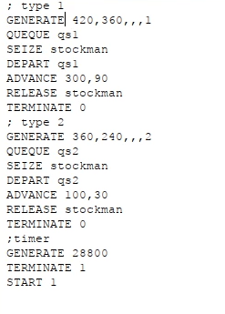
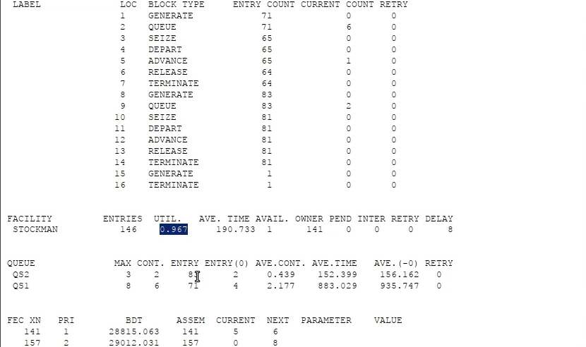
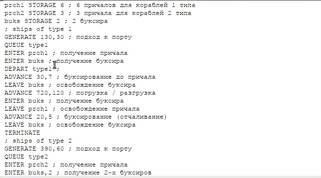
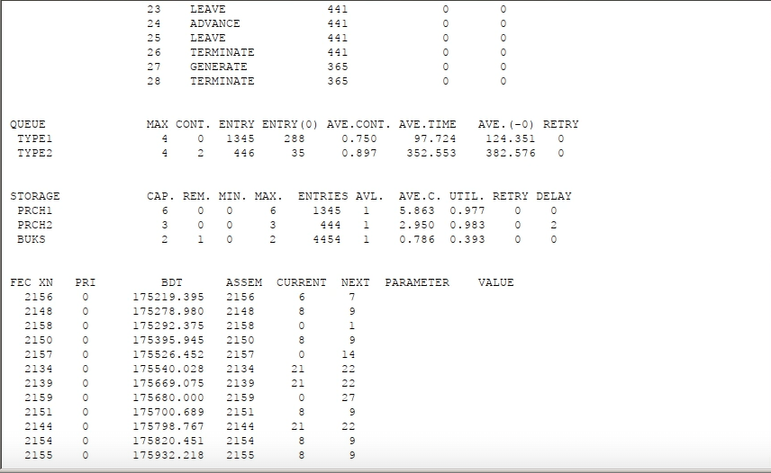

---
## Front matter
title: "Лабораторная работа 15"
subtitle: "Имитационное моделирование"
author: "Голощапов Ярослав Вячеславович"

## Generic otions
lang: ru-RU
toc-title: "Содержание"

## Bibliography
bibliography: bib/cite.bib
csl: pandoc/csl/gost-r-7-0-5-2008-numeric.csl

## Pdf output format
toc: true # Table of contents
toc-depth: 2
lof: true # List of figures
lot: true # List of tables
fontsize: 12pt
linestretch: 1.5
papersize: a4
documentclass: scrreprt
## I18n polyglossia
polyglossia-lang:
  name: russian
  options:
	- spelling=modern
	- babelshorthands=true
polyglossia-otherlangs:
  name: english
## I18n babel
babel-lang: russian
babel-otherlangs: english
## Fonts
mainfont: IBM Plex Serif
romanfont: IBM Plex Serif
sansfont: IBM Plex Sans
monofont: IBM Plex Mono
mathfont: STIX Two Math
mainfontoptions: Ligatures=Common,Ligatures=TeX,Scale=0.94
romanfontoptions: Ligatures=Common,Ligatures=TeX,Scale=0.94
sansfontoptions: Ligatures=Common,Ligatures=TeX,Scale=MatchLowercase,Scale=0.94
monofontoptions: Scale=MatchLowercase,Scale=0.94,FakeStretch=0.9
mathfontoptions:
## Biblatex
biblatex: true
biblio-style: "gost-numeric"
biblatexoptions:
  - parentracker=true
  - backend=biber
  - hyperref=auto
  - language=auto
  - autolang=other*
  - citestyle=gost-numeric
## Pandoc-crossref LaTeX customization
figureTitle: "Рис."
tableTitle: "Таблица"
listingTitle: "Листинг"
lofTitle: "Список иллюстраций"
lotTitle: "Список таблиц"
lolTitle: "Листинги"
## Misc options
indent: true
header-includes:
  - \usepackage{indentfirst}
  - \usepackage{float} # keep figures where there are in the text
  - \floatplacement{figure}{H} # keep figures where there are in the text
---

# Цель работы

Построение моделей обслуживания с приоритетами

# Выполнение лабораторной работы

# Модель обслуживания механиков на складе

**Постановка задачи**
На фабрике на складе работает один кладовщик, который выдает запасные части
механикам, обслуживающим станки. Время, необходимое для удовлетворения за-
проса, зависит от типа запасной части. Запросы бывают двух категорий. Для первой
категории интервалы времени прихода механиков 420 ± 360 сек., время обслужива-
ния — 300 ± 90 сек. Для второй категории интервалы времени прихода механиков
360 ± 240 сек., время обслуживания — 100 ± 30 сек.

Порядок обслуживания механиков кладовщиком такой: запросы первой категории
обслуживаются только в том случае, когда в очереди нет ни одного запроса второй
категории. Внутри одной категории дисциплина обслуживания — «первым пришел –
первым обслужился». Необходимо создать модель работы кладовой, моделирование
выполнять в течение восьмичасового рабочего дня. 

Строим модель (рис. [-@fig:001]). 

{#fig:001 width=70%}

Запускаем симуляцию и получаем отчёт по модели обслуживания механиков с приоритетами (рис. [-@fig:002]) 

{#fig:002 width=70%}

# Модель обслуживания в порту судов двух типов

**Постановка задачи**
Морские суда двух типов прибывают в порт, где происходит их разгрузка. В порту
есть два буксира, обеспечивающих ввод и вывод кораблей из порта. К первому
типу судов относятся корабли малого тоннажа, которые требуют использования
одного буксира. Корабли второго типа имеют большие размеры, и для их ввода
и вывода из порта требуется два буксира. Из-за различия размеров двух типов
кораблей необходимы и причалы различного размера. Кроме того, корабли имеют
различное время погрузки/разгрузки.

Требуется построить модель системы, в которой можно оценить время ожидания
кораблями каждого типа входа в порт. Время ожидания входа в порт включает время
ожидания освобождения причала и буксира. Корабль, ожидающий освобождения
причала, не обслуживается буксиром до тех пор, пока не будет предоставлен нужный
причал. Корабль второго типа не займёт буксир до тех пор, пока ему не будут
доступны оба буксира.

Строим модель (рис. [-@fig:003])

{#fig:003 width=70%}

Выводим отчёт (рис. [-@fig:004]).

{#fig:004 width=70%}

# Выводы

В этой лабораторной работе я приобрел навыки построения моделей обслуживания с приоритетами

