---
## Front matter
lang: ru-RU
title: Лабораторная работа 16
subtitle: Имитационное моделирование
author:
  - Голощапов Ярослав Вячеславович
institute:
  - Российский университет дружбы народов, Москва, Россия
date: 10 марта 2025

## i18n babel
babel-lang: russian
babel-otherlangs: english

## Formatting pdf
toc: false
toc-title: Содержание
slide_level: 2
aspectratio: 169
section-titles: true
theme: metropolis
header-includes:
 - \metroset{progressbar=frametitle,sectionpage=progressbar,numbering=fraction}
---

# Информация

## Докладчик

:::::::::::::: {.columns align=center}
::: {.column width="70%"}

  * Голощапов Ярослав Вячеславович
  * студент 3 курса
  * Российский университет дружбы народов
  * [1132222003@pfur.ru](mailto:1132222003@pfur.ru)
  * <https://yvgoloschapov.github.io/ru/>

:::
::: {.column width="30%"}

:::
::::::::::::::

## Цель работы

Построение модели двух стратегий обслуживания

## Задание

На пограничном контрольно -пропускном пункте транспорта имеются 2 пункта
пропуска. Интервалы времени между поступлением автомобилей имеют экспоненци-
альное распределение со средним значением μ. Время прохождения автомобилями
пограничного контроля имеет равномерное распределение на интервале [a, b].
Предлагается две стратегии обслуживания прибывающих автомобилей:
1) автомобили образуют две очереди и обслуживаются соответствующими пунктами
пропуска;
2) автомобили образуют одну общую очередь и обслуживаются освободившимся
пунктом пропуска.
Исходные данные: μ = 1, 75 мин, a = 1 мин, b = 7 мин

# Выполнение лабораторной работы

## Целью моделирования является определение:
– характеристик качества обслуживания автомобилей, в частности, средних длин
очередей; среднего времени обслуживания автомобиля; среднего времени пребы-
вания автомобиля на пункте пропуска;
– наилучшей стратегии обслуживания автомобилей на пункте пограничного кон-
троля;
– оптимального количества пропускных пунктов.
В качестве критериев, используемых для сравнения стратегий обслуживания
автомобилей, выберем:
– коэффициенты загрузки системы;
– максимальные и средние длины очередей;
– средние значения времени ожидания обслуживания.
Для первой стратегии обслуживания, когда прибывающие автомобили образуют
две очереди и обслуживаются соответствующими пропускными пунктами, имеем
следующую модель: 

##

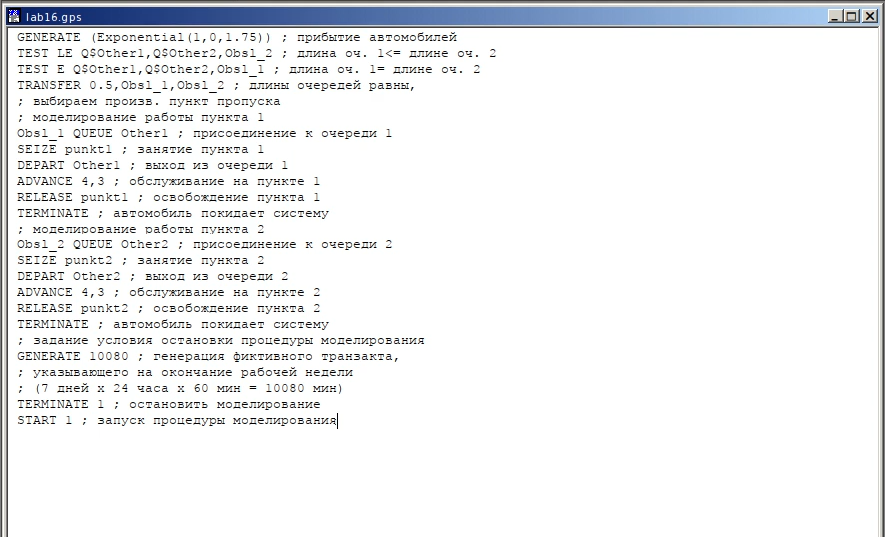{#fig:001 width=70%}

##

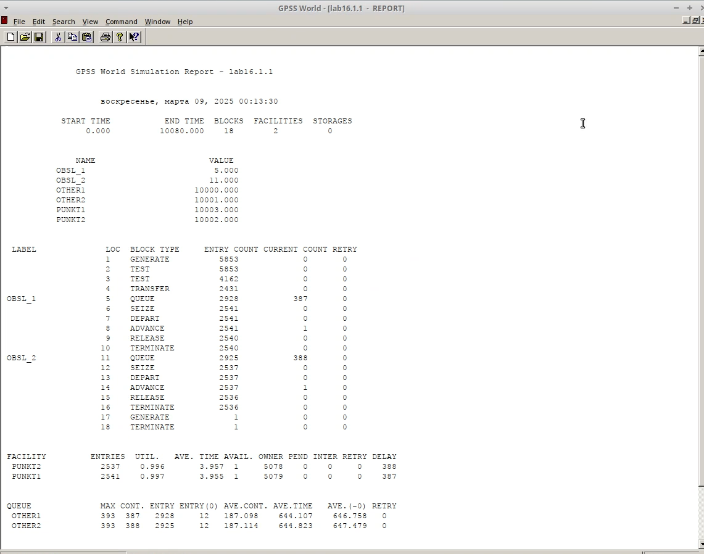{#fig:002 width=70%}

## **Задание**
– составить модель для второй стратегии обслуживания, когда прибывающие авто-
мобили образуют одну очередь и обслуживаются освободившимся пропускным
пунктом; 
– свести полученные статистики моделирования в таблицу
– по результатам моделирования сделать вывод о наилучшей стратегии обслужива-
ния автомобилей;

##

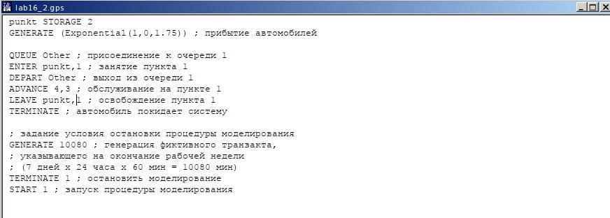{#fig:003 width=70%}

##

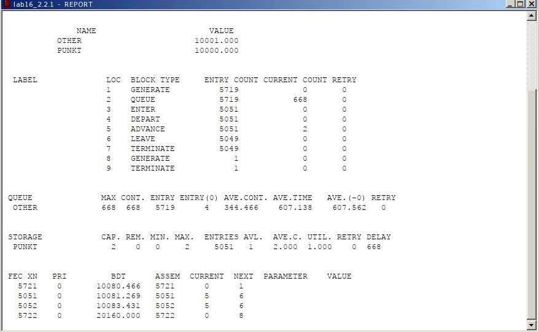{#fig:004 width=70%}

##

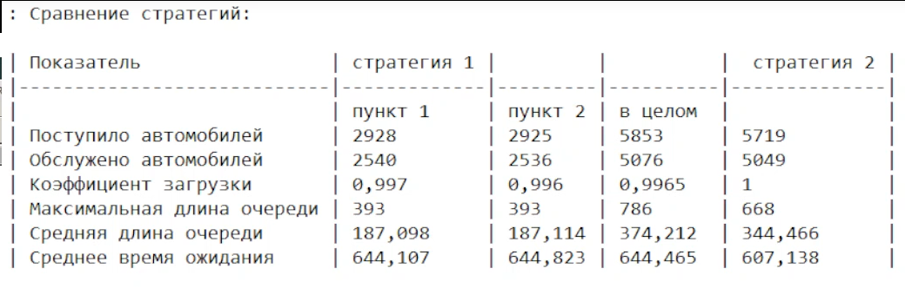{#fig:005 width=70%}

##

– изменив модели, определить оптимальное число пропускных пунктов (от 1 до 4)
для каждой стратегии при условии, что:
– коэффициент загрузки пропускных пунктов принадлежит интервалу (0.5; 0.95);
– среднее число автомобилей, одновременно находящихся на контрольно -пропускном пункте, не должно превышать 3;
– среднее время ожидания обслуживания не должно превышать 4 мин.

## Для обеих стратегий модель с одним пунктом выглядит одинаково 

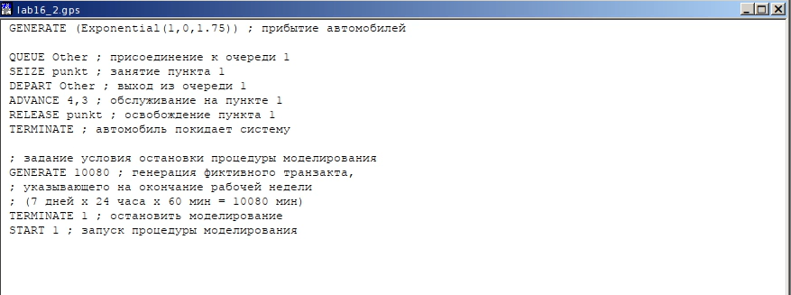{#fig:006 width=70%}

##

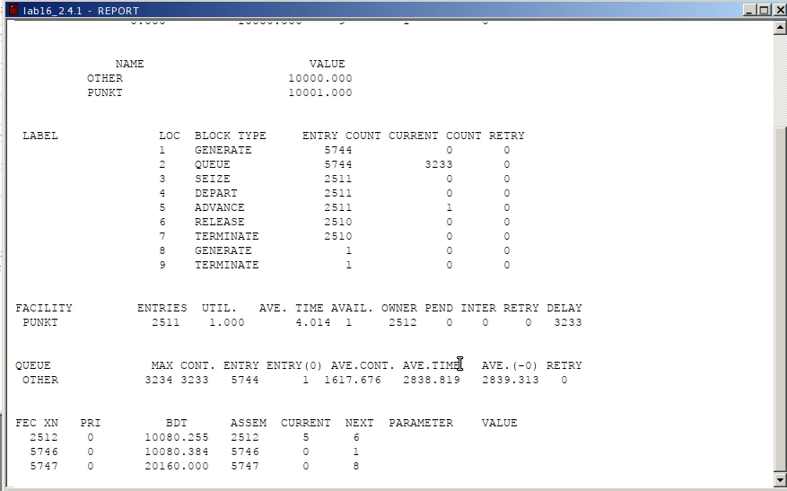{#fig:007 width=70%}

В этом случае модель не проходит ни по одному из критериев

## Далее строим модель с 3 пропускными пунктами для первой стратегии 

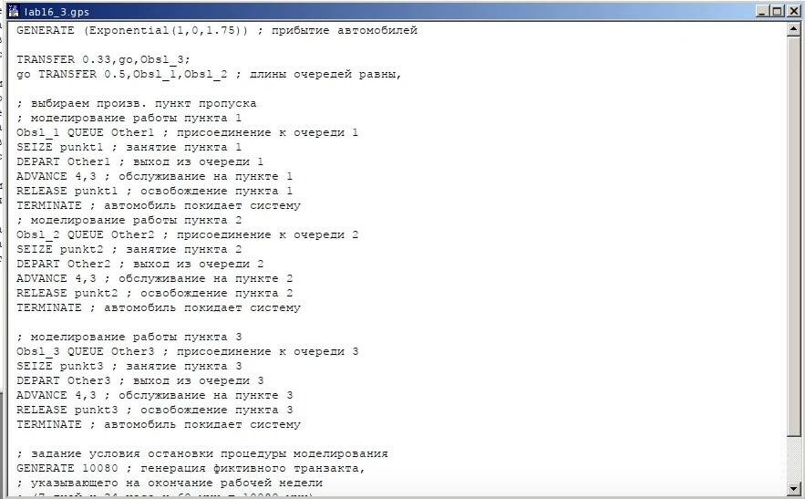{#fig:008 width=70%}

##

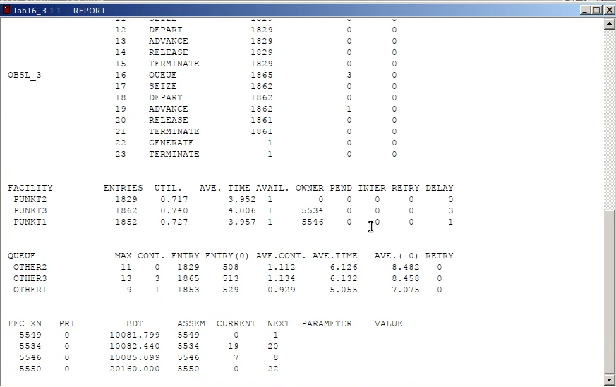{#fig:009 width=70%}

В этом случае среднее врем ожидания превышает 4мин, поэтому модель не подходит

## Строим модель для первой стратегии с 4 пунктами 

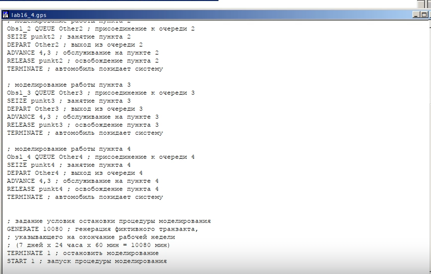{#fig:010 width=70%}

##

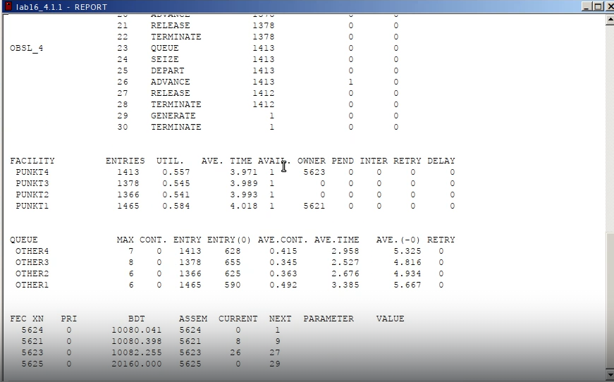{#fig:011 width=70%}

В этом случае все критерии выполнены, поэтому 4 пункта являются оптимальными для первой стратегии

## Посторение модели для второй стратегии с 3 пропускными пунктами 

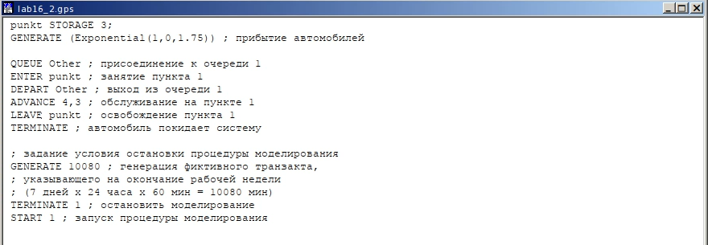{#fig:012 width=70%}

##

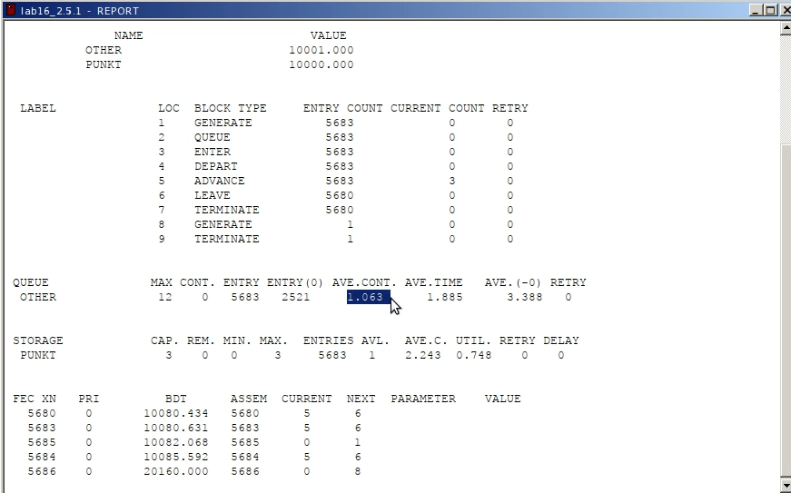{#fig:013 width=70%}

В этом случае все критерии выполняются, поэтому модель оптимальна

## Посторение модели для второй стратегии с 4 пропускными пунктами 

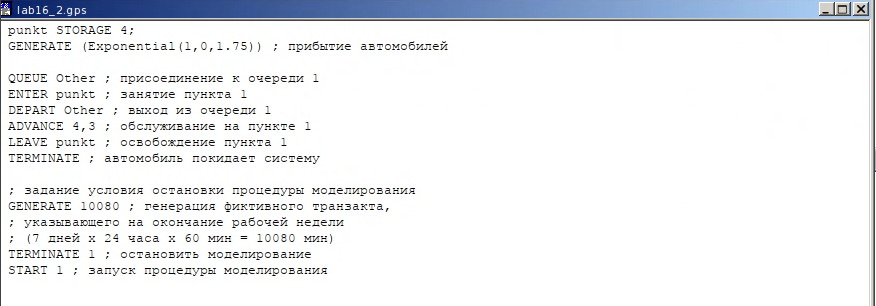{#fig:014 width=70%}

##

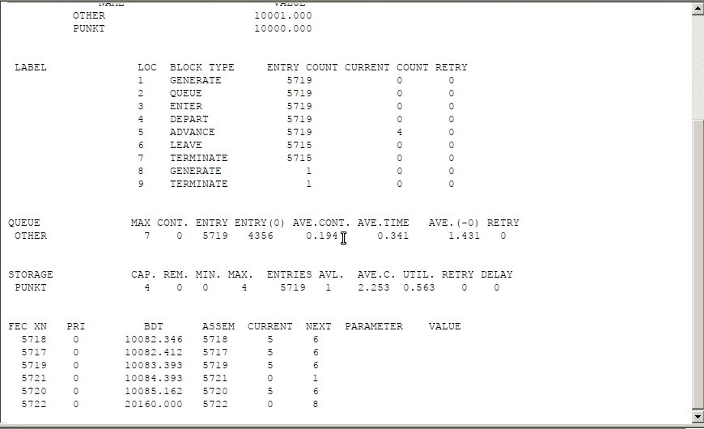{#fig:015 width=70%}

Здесь все критерии выполнены, однако можно увидеть, что система излишне разгружена.

##

В результате анализа наилучшим количеством пропусных пунктов будет 4 при первой стратегии и 3 при второй

## Выводы

В этой лабораторной работе я приобрел навыки построения модели двух стратегий обслуживания
