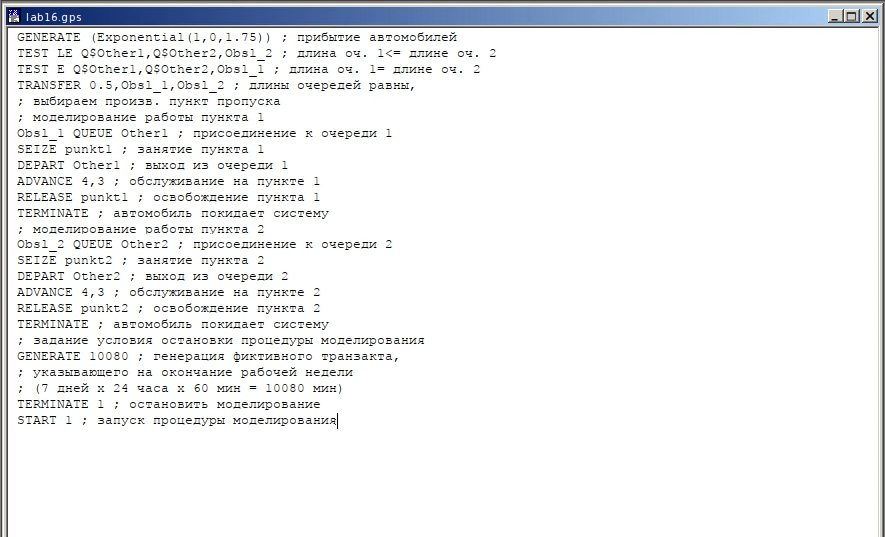

---
## Front matter
title: "Лабораторная работа 16"
subtitle: "Имитационное моделирование"
author: "Голощапов Ярослав Вячеславович"

## Generic otions
lang: ru-RU
toc-title: "Содержание"

## Bibliography
bibliography: bib/cite.bib
csl: pandoc/csl/gost-r-7-0-5-2008-numeric.csl

## Pdf output format
toc: true # Table of contents
toc-depth: 2
lof: true # List of figures
lot: true # List of tables
fontsize: 12pt
linestretch: 1.5
papersize: a4
documentclass: scrreprt
## I18n polyglossia
polyglossia-lang:
  name: russian
  options:
	- spelling=modern
	- babelshorthands=true
polyglossia-otherlangs:
  name: english
## I18n babel
babel-lang: russian
babel-otherlangs: english
## Fonts
mainfont: IBM Plex Serif
romanfont: IBM Plex Serif
sansfont: IBM Plex Sans
monofont: IBM Plex Mono
mathfont: STIX Two Math
mainfontoptions: Ligatures=Common,Ligatures=TeX,Scale=0.94
romanfontoptions: Ligatures=Common,Ligatures=TeX,Scale=0.94
sansfontoptions: Ligatures=Common,Ligatures=TeX,Scale=MatchLowercase,Scale=0.94
monofontoptions: Scale=MatchLowercase,Scale=0.94,FakeStretch=0.9
mathfontoptions:
## Biblatex
biblatex: true
biblio-style: "gost-numeric"
biblatexoptions:
  - parentracker=true
  - backend=biber
  - hyperref=auto
  - language=auto
  - autolang=other*
  - citestyle=gost-numeric
## Pandoc-crossref LaTeX customization
figureTitle: "Рис."
tableTitle: "Таблица"
listingTitle: "Листинг"
lofTitle: "Список иллюстраций"
lotTitle: "Список таблиц"
lolTitle: "Листинги"
## Misc options
indent: true
header-includes:
  - \usepackage{indentfirst}
  - \usepackage{float} # keep figures where there are in the text
  - \floatplacement{figure}{H} # keep figures where there are in the text
---

# Цель работы

Построение модели двух стратегий обслуживания

# Задание

На пограничном контрольно -пропускном пункте транспорта имеются 2 пункта
пропуска. Интервалы времени между поступлением автомобилей имеют экспоненци-
альное распределение со средним значением μ. Время прохождения автомобилями
пограничного контроля имеет равномерное распределение на интервале [a, b].
Предлагается две стратегии обслуживания прибывающих автомобилей:
1) автомобили образуют две очереди и обслуживаются соответствующими пунктами
пропуска;
2) автомобили образуют одну общую очередь и обслуживаются освободившимся
пунктом пропуска.
Исходные данные: μ = 1, 75 мин, a = 1 мин, b = 7 мин

# Выполнение лабораторной работы

Целью моделирования является определение:
– характеристик качества обслуживания автомобилей, в частности, средних длин
очередей; среднего времени обслуживания автомобиля; среднего времени пребы-
вания автомобиля на пункте пропуска;
– наилучшей стратегии обслуживания автомобилей на пункте пограничного кон-
троля;
– оптимального количества пропускных пунктов.
В качестве критериев, используемых для сравнения стратегий обслуживания
автомобилей, выберем:
– коэффициенты загрузки системы;
– максимальные и средние длины очередей;
– средние значения времени ожидания обслуживания.
Для первой стратегии обслуживания, когда прибывающие автомобили образуют
две очереди и обслуживаются соответствующими пропускными пунктами, имеем
следующую модель: (рис. [-@fig:001]). (рис. [-@fig:002])

{#fig:001 width=70%}

{#fig:002 width=70%}

**Задание**
– составить модель для второй стратегии обслуживания, когда прибывающие авто-
мобили образуют одну очередь и обслуживаются освободившимся пропускным
пунктом;  (рис. [-@fig:003]) (рис. [-@fig:004])
– свести полученные статистики моделирования в таблицу (рис. [-@fig:005])
– по результатам моделирования сделать вывод о наилучшей стратегии обслужива-
ния автомобилей;

{#fig:003 width=70%}

{#fig:004 width=70%}

{#fig:005 width=70%}

– изменив модели, определить оптимальное число пропускных пунктов (от 1 до 4)
для каждой стратегии при условии, что:
– коэффициент загрузки пропускных пунктов принадлежит интервалу (0.5; 0.95);
– среднее число автомобилей, одновременно находящихся на контрольно -пропускном пункте, не должно превышать 3;
– среднее время ожидания обслуживания не должно превышать 4 мин.

 Для обеих стратегий модель с одним пунктом выглядит одинаково (рис. [-@fig:006]) (рис. [-@fig:007])

{#fig:006 width=70%}

{#fig:007 width=70%}

В этом случае моедльне проходит ни по одному из критериев

Далее строим модель с 3 пропускными пунктами для первой стратегии (рис. [-@fig:008]) (рис. [-@fig:009])

{#fig:008 width=70%}

{#fig:009 width=70%}

В этом случае среднее врем ожидания превышает 4мин, поэтому модель не подходит

Строим модель для первой стратегии с 4 пунктами (рис. [-@fig:010]) (рис. [-@fig:011])

{#fig:010 width=70%}

{#fig:011 width=70%}

В этом случае все критерии выполнены, поэтому 4 пункта являются оптимальными для первой стратегии

Посторение модели для второй стратегии с 3 пропускными пунктами (рис. [-@fig:012]) (рис. [-@fig:013])

{#fig:012 width=70%}

{#fig:013 width=70%}

В этом случае все критерии выполняются, поэтому модель оптимальна

Посторение модели для второй стратегии с 4 пропускными пунктами (рис. [-@fig:014]) (рис. [-@fig:015])

{#fig:014 width=70%}

{#fig:015 width=70%}

Здесь все критерии выполнены, однако можно увидеть, что система излишне разгружена.

В результате анализа наилучшим количеством пропусных пунктов будет 4 при первой стратегии и 3 при второй

# Выводы

В этой лабораторной работе я приобрел навыки построения модели двух стратегий обслуживания

