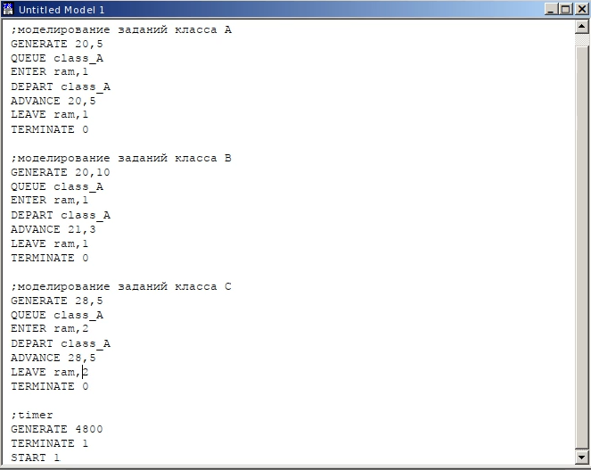
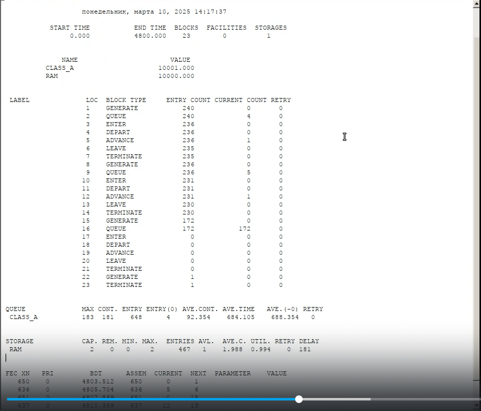
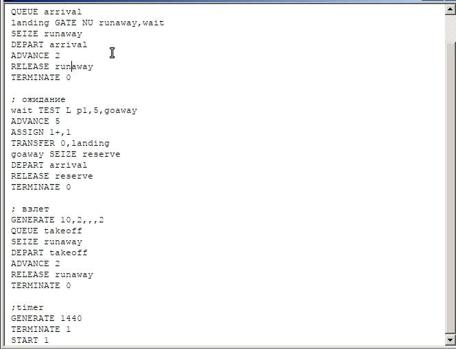
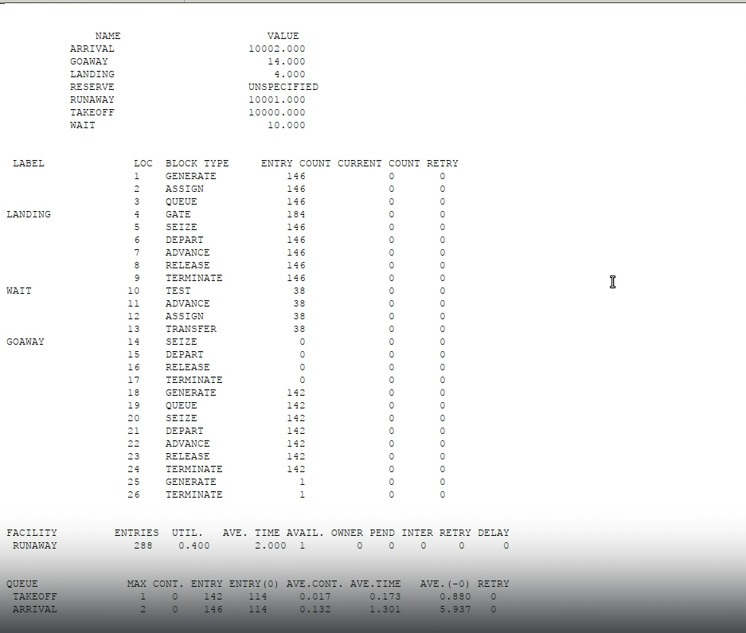
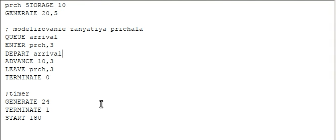
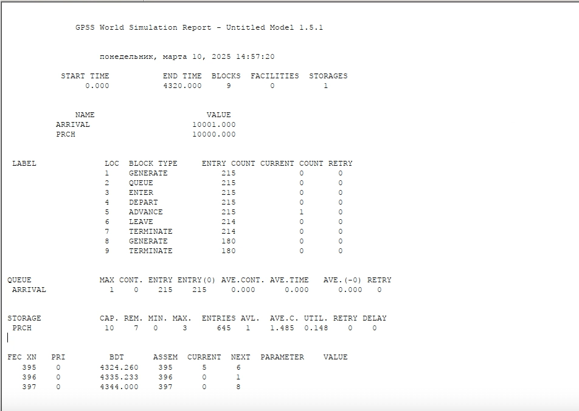
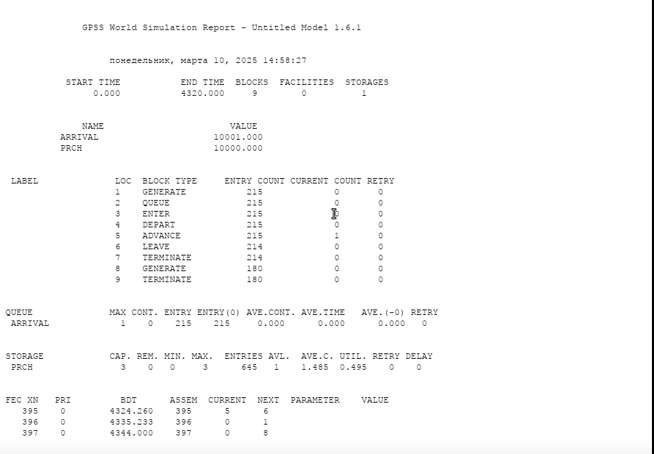
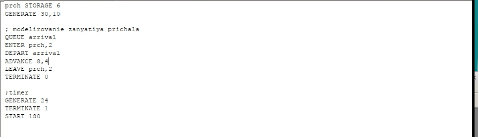
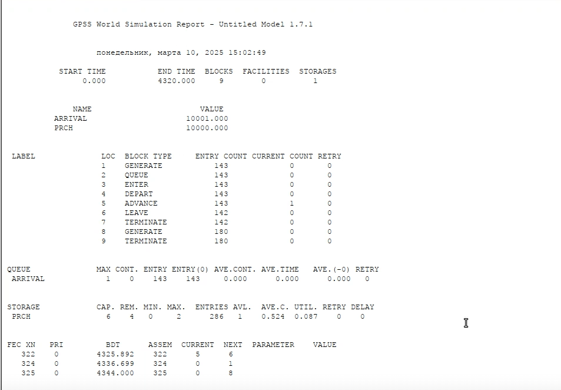
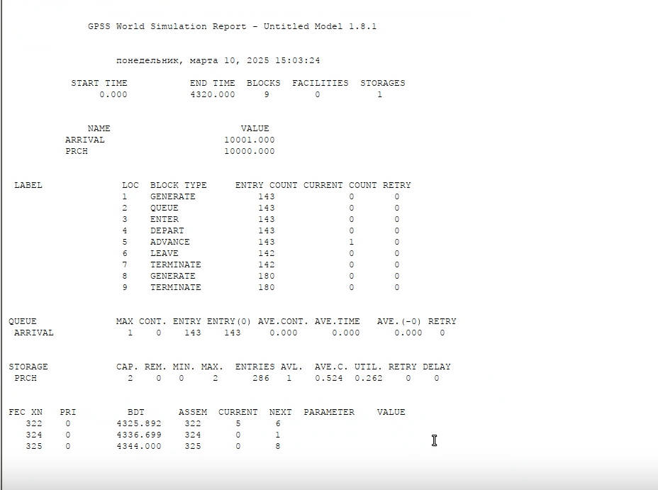

---
## Front matter
title: "Лабораторная работа 17"
subtitle: "Имитационное моделирование"
author: "Голощапов Ярослав Вячеславович"

## Generic otions
lang: ru-RU
toc-title: "Содержание"

## Bibliography
bibliography: bib/cite.bib
csl: pandoc/csl/gost-r-7-0-5-2008-numeric.csl

## Pdf output format
toc: true # Table of contents
toc-depth: 2
lof: true # List of figures
lot: true # List of tables
fontsize: 12pt
linestretch: 1.5
papersize: a4
documentclass: scrreprt
## I18n polyglossia
polyglossia-lang:
  name: russian
  options:
	- spelling=modern
	- babelshorthands=true
polyglossia-otherlangs:
  name: english
## I18n babel
babel-lang: russian
babel-otherlangs: english
## Fonts
mainfont: IBM Plex Serif
romanfont: IBM Plex Serif
sansfont: IBM Plex Sans
monofont: IBM Plex Mono
mathfont: STIX Two Math
mainfontoptions: Ligatures=Common,Ligatures=TeX,Scale=0.94
romanfontoptions: Ligatures=Common,Ligatures=TeX,Scale=0.94
sansfontoptions: Ligatures=Common,Ligatures=TeX,Scale=MatchLowercase,Scale=0.94
monofontoptions: Scale=MatchLowercase,Scale=0.94,FakeStretch=0.9
mathfontoptions:
## Biblatex
biblatex: true
biblio-style: "gost-numeric"
biblatexoptions:
  - parentracker=true
  - backend=biber
  - hyperref=auto
  - language=auto
  - autolang=other*
  - citestyle=gost-numeric
## Pandoc-crossref LaTeX customization
figureTitle: "Рис."
tableTitle: "Таблица"
listingTitle: "Листинг"
lofTitle: "Список иллюстраций"
lotTitle: "Список таблиц"
lolTitle: "Листинги"
## Misc options
indent: true
header-includes:
  - \usepackage{indentfirst}
  - \usepackage{float} # keep figures where there are in the text
  - \floatplacement{figure}{H} # keep figures where there are in the text
---

# Цель работы

Выполнить задания для самостоятельной работы

# Задание

Смоделировать работу 3 моделей

# Выполнение лабораторной работы

## Моделирование работы вычислительного центра
На вычислительном центре в обработку принимаются три класса заданий А, В и С.
Исходя из наличия оперативной памяти ЭВМ задания классов А и В могут решаться
одновременно, а задания класса С монополизируют ЭВМ. Задания класса А посту-
пают через 20 ± 5 мин, класса В — через 20 ± 10 мин, класса С — через 28 ± 5 мин
и требуют для выполнения: класс А — 20 ± 5 мин, класс В — 21 ± 3 мин, класс
С — 28 ± 5 мин. Задачи класса С загружаются в ЭВМ, если она полностью свободна.
Задачи классов А и В могут дозагружаться к решающей задаче.
Смоделировать работу ЭВМ за 80 ч. Определить её загрузку (рис. [-@fig:001]). 

{#fig:001 width=70%}

Запускаем симуляцию и получаем отчёт по модели (рис. [-@fig:002]) 

{#fig:002 width=70%}

Из отчета видим что загруженность составляет 0.994

## Модель работы аэропорта
Самолёты прибывают для посадки в район аэропорта каждые 10 ± 5 мин. Если
взлетно- посадочная полоса свободна, прибывший самолёт получает разрешение на
посадку. Если полоса занята, самолет выполняет полет по кругу и возвращается
в аэропорт каждые 5 мин. Если после пятого круга самолет не получает разрешения
на посадку, он отправляется на запасной аэродром.
В аэропорту через каждые 10 ± 2 мин к взлетно -посадочной полосе выруливают
готовые к взлёту самолёты и получают разрешение на взлёт, если полоса свободна.
Для взлета и посадки самолёты занимают полосу ровно на 2 мин. Если при свободной
полосе одновременно один самолёт прибывает для посадки, а другой — для взлёта,
то полоса предоставляется взлетающей машине.
**Требуется:**
– выполнить моделирование работы аэропорта в течение суток;
– подсчитать количество самолётов, которые взлетели, сели и были направлены на
запасной аэродром;
– определить коэффициент загрузки взлетно-посадочной полосы

Строим модель (рис. [-@fig:003])

{#fig:003 width=70%}

Выводим отчёт (рис. [-@fig:004]).

{#fig:004 width=70%}

Из отчета видим что взлетело 142 самолета, село 146, а отправилось на запасной аэропорт 0. Коэффициент загрузки полосы равен 0.4

## Моделирование работы морского порта
Морские суда прибывают в порт каждые [a ± δ] часов. В порту имеется N причалов.
Каждый корабль по длине занимает M причалов и находится в порту [b ± ε] часов.
Требуется построить GPSS-модель для анализа работы морского порта в течение
полугода, определить оптимальное количество причалов для эффективной работы
порта.
Исходные данные:
1) a = 20 ч, δ = 5 ч, b = 10 ч, ε = 3 ч, N = 10, M = 3;
2) a = 30 ч, δ = 10 ч, b = 8 ч, ε = 4 ч, N = 6, M = 2.

### Первый вариант

Строим модель для первого варианта (рис. [-@fig:005])

{#fig:005 width=70%}

Выводим отчет (рис. [-@fig:006])

{#fig:006 width=70%}

При запуске с 10 причалами видно, что судна обрабатываются быстрее, чем успевают приходить новые, так как очередь не набирается. Кроме того загруженность причалов очень низкая. Соответственно, установив наименьшее возможное число причалов -- 3, получаем оптимальный результат, что видно на отчете (рис. [-@fig:007]).
 
{#fig:007 width=70%}

### Второй вариант

Строим модель для второго варианта (рис. [-@fig:008]).

{#fig:008 width=70%}

После запуска симуляции получаем отчёт (рис. [-@fig:009]).

{#fig:009 width=70%}

При запуске с 6 причалами видно, что судна обрабатываются быстрее, чем успевают приходить новые, так как очередь не набирается. Кроме того загруженность причалов очень низкая. Соответственно, установив наименьшее возможное число причалов -- 2, получаем оптимальный результат, что видно на отчете (рис. [-@fig:010])

{#fig:010 width=70%}

# Выводы

В этой лабораторной работе я реализовал 3 модели :
1.Модель работы вычислительного центра
2.Модель работы аэропорта
3.Модель работы морского порта

